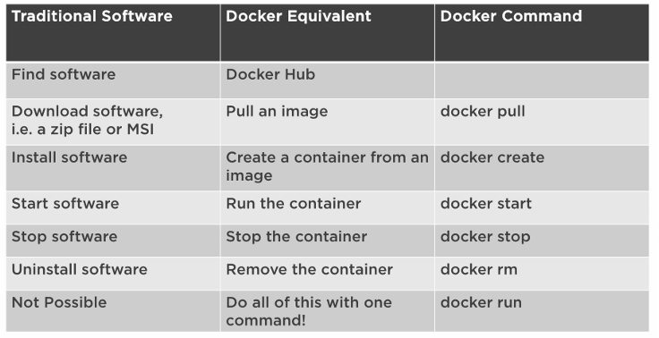
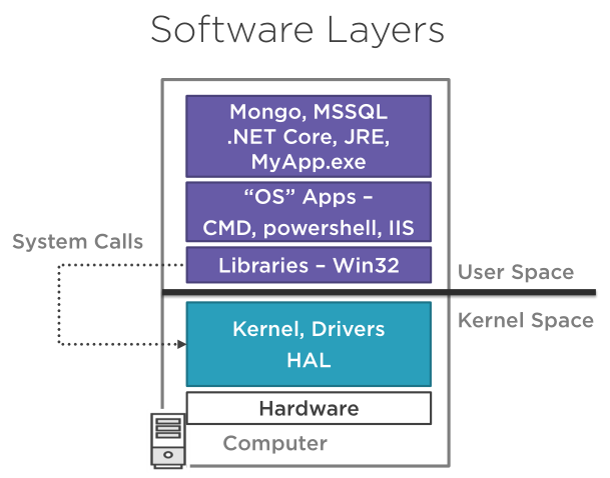
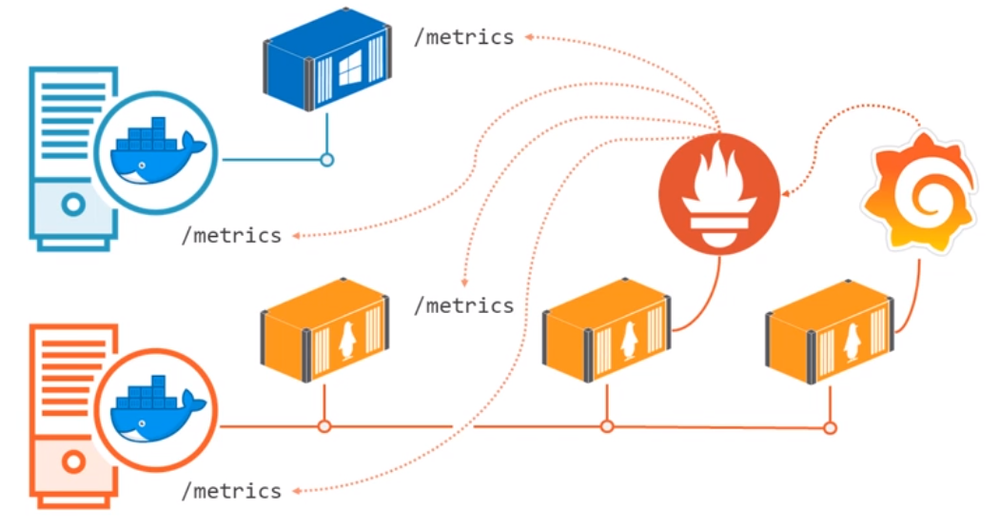
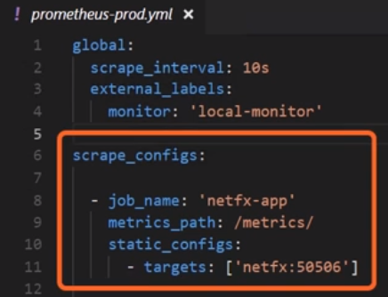
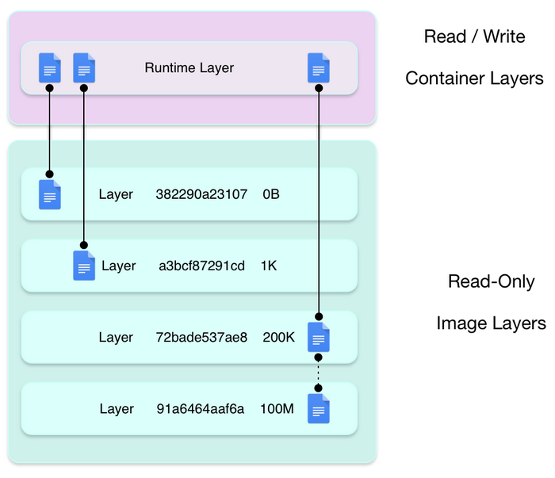
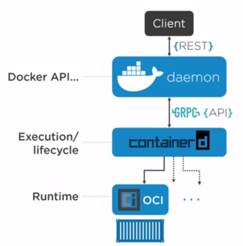
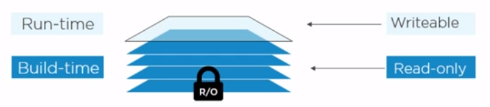
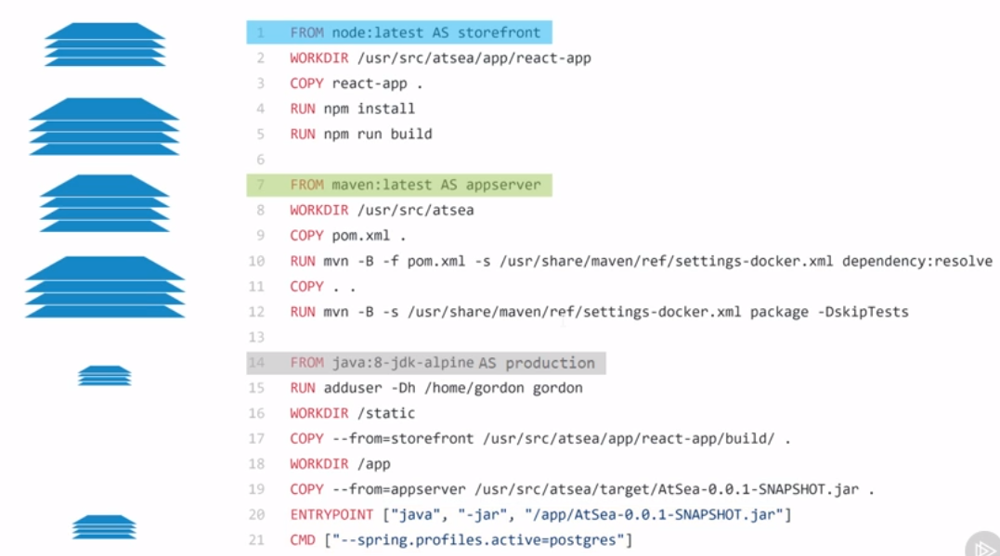

# Docker workshop 1: introduction to docker

To explain docker, start from the need behind it.

Example scenario: I want to serve a web application (written in .js). I have no idea what to use to serve static files (I need an HTTP server: apache, tomcat, nginx?). Nginx sounds cool.

## Challenges to run a software

- Find something to download
- Do I trust this software? Do I trust the link
- Find the right release (linuxdistrib/windows, which version of the OS, 32/64bits)
- Understand the installation process (.exe to install? .zip to unzip? Variables to create? So on)
- Do I need to install dependencies?
- How do i start it?
- In the end what was install on my computer?
- Can it break if I update my OS or dependencies and so on…

## Installation on windows

Doc: https://docs.docker.com/docker-for-windows/install/.

Requirements:

- Linux/windows vm
- Hyper-v
- Minimal conf (win10 update) + **CAN NOT USE SIMULTANEOUSLY WITH VMWARE!**

## Run nginx (engine X)

```bash
docker search nginx
docker pull nginx:alpine
docker create nginx:alpine
docker ps -a
docker start ID
docker stop ID
docker rm ID
docker rmi nginx:alpine
```

Talk about tags (latest by default) and registries: https://hub.docker.com/_/nginx.

## Open a shell on a running container

```bash
docker exec -it CONTAINERID
export HTTP_PROXY=http://lyon.proxy.corp.sopra:8080
apk update
apk add curl
curl http://localhost:80
```

## Show our container ip

- ip a s
- Docker inspect CONTAINER
- http://CONTAINER_IP:80

## Access a container port

Recreate with `-p 80:80`.

## Docker run



- STANDARD OUTPUT = log of the app
- CTRL+C without - it option and with - it option
- CTRL+PQ to detach from - it

Show the persistance of data while the container is alive (even stopped).

## Create an image

### Interactively

Copying files from containers nginx -d and copy files to the container /usr/share/nginx/html

```bash
Docker run -d --name ng -p 80:80 nginx:alpine
docker cp .\solitaire\app\. ng:/usr/share/nginx/html
#Create an image interactively by doing stuff inside the container and saving container as an image (docker commit)
Docker commit ng solitaire:nginx
Docker image ls
```

### Create from dockerFile

```DockerFile
FROM nginx:alpine
COPY app\ /usr/share/nginx/html
```

`Docker build -t solitaire:build .`

`docker save solitaire:nginx -o solitaire.tar`

**Image -> Container -> Image.**

Explain the layers.



### Make the container access the host filesystem

`docker run --rm --name ng -v C:\data\docker\demo\solitaire\app:/usr/share/nginx/html:ro -p 8080:80 -d nginx:alpine`

## Run CLI

Run CLI tool: https://github.com/rg3/youtube-dl.

Requirements:

- python
- ffmpeg
- youtube-dl

```DockerFile
FROM python:alpine

RUN pip install --upgrade youtube-dl \
 && mkdir -p /download

RUN apk upgrade -U \
 && apk add ca-certificates ffmpeg libva-intel-driver \
 && rm -rf /var/cache/*

WORKDIR /download

ENTRYPOINT ["youtube-dl"]
```

build it:

```bash
docker build -t youtube-dl .
```

run it:

```bash
docker run --rm --name youtube-dl -v E:/Download/musiques:/download youtube-dl --yes-playlist --extract-audio --audio-format mp3 -o %(title)s.%(ext)s --download-archive archive.txt "myplaylisturl"
```

## TODO NEXT

- Show portainer
- Switch to windows containers (show of they are separated list images/containers)
- Docker inspect to get the ip of the container (don't use the mapped port if using this ip, use the actual container port)
- Isolation: process/filesystem/network
- Using docker for cmd line tools like tar
- Mounting volumes (bind-mount = from host file system) -v
- Docker volume ls, named volume (managed volume) -v NAME:/path/in/container
- Stop all containers: Docker stop $(docker ps -q)
- Docker compose file (create a network so that containers can talk to each other + DNS to ping containers with their service name)
- Docker compose up/down inspect
- Docker network (bridge by default)
- Docker-compose exec CONTAINER bash
- Docker network inspect DOCKERCOMPOSEPROJECT_default
- Docker run --it --rm --net PROJECT_default alpine sh / ping HOST / 
- logging drivers
- how to log properly
- fluentd elasticsearch kibana
- health check

Start on windows images
show where the layers are stored
talk about volumes
show where they are stored
container names
switch to linux containers
not the same place to see images/volumes?
mobi linux vm

Access mobyLinuxVM (Hyper-V on windows)

```bash
# Run this from your regular terminal on Windows / MacOS:
docker container run --rm -it -v /:/host alpine

# Once you're in the container that we just ran, run this:
    chroot /host
```

docker is not virtualization. 
virtualization = an hypervisor grabs physical ressources (RAM/CPU/storage/netwok) slices them into virtual versions RAM/CPU... then builds virtual machine on them. Which looks like real machines
docker = slices operating system resources PID ns, NET ns, FS ns. Every container gets its PID 1, root file system (chroot) = operating system virtualisation

bad old days = applications run businesses, they are key. In the past, we had 1 application = 1 machine. We would choose machines to big for the task, just to be sure it runs correctly. We only use a few percent of the capability.
then came VMs, which allows to run multiple applications on one physical machine.
The problems with VM (imagine 4 VMs on 1 server):

- multiplication of installations (for OS).
- OS takes resources just to be ready to run apps! doesn't do anything but steals energy.
- licencing problem because we have 4 install of our OS.
- requires admin on each OS : update/patches/anti virus

With VM, we keep our application as it is and just run it with virtualization.
With containers (we can do the same BUT), the ultimate goal is to get apps that are scalable, self-healed, portable...

docker = the company and the technology (run apps in containers) = dock + worker
2 versions : community edition and entreprise edition (with fewer releases, more features + quality support). All opensource.

Kubernetes developed from google, openesource. Was used to manage containers at google way back (1999!)
kubernetes is greek for helmsman (timonier) (captain, of a ship), the one who steers the ship.
docker is about managing 1 app, low lvl stuff start/stop etc...
kubernetes is higher level : scheduling, updating, scaling, healing... Orchestrator (think about containerized apps as sound from instruments in an orchestra)
A kubernetes cluster is composed of nodes. Each node as an install with kubernetes agent + docker runtime to manage containers.
kubernetes manages containerized app. You can package an app and tell k8s what containerized app to run, how many, on which port and so on. It decouples the application from the server, so you can move from could to on premise and vice versa.

https://labs.play-with-docker.com/
https://labs.play-with-k8s.com/

docker and kubernetes are perfectly capable of running : legacy app, stateless app and stateful app (with persisent data).


On your local dev env, it is easy to run an app with docker-compose. But we are limited to the resources of our machine.
What about production? we want multiple nodes (= machines) to run our app. Several nodes working together is called a cluster.
Swarm mode is the orchestrator of docker. It has the same purpose as kubernetes.


Container images are specific to the OS and CPU they are built on. If you want your image to run on multiple CPU architectures, you have to build to target each specific CPU.
The different different architecture are built in a single image, so you can seamlessly do a docker pull xxx without worrying about your host architecture.
Good images to explain that : https://www.docker.com/blog/multi-arch-all-the-things/.
Illustrate this : https://hub.docker.com/layers/mongo/library/mongo/latest/images/sha256-2e24032659c947cb4748084f4516933bee66f4ef039e51cd9474710024022c9c.
See https://docs.docker.com/docker-for-mac/multi-arch/.


## Monitoring app

It is different than monitoring on servers. Where you can use nagios (linux) or scom (win). They push metrics to a central server.
Containers are stopped/started often, those tools are not adapted.



Prometheus is a polling server that request servers to pull some metrics.
You configure prometheus to poll every x seconds on given metrics endpoint. Those endpoints are configured to return prometheus format data (1 metric per line and then : key value). This gives you timeseries.



Grafana allows to visualize data from prometheus in dashboards.
Docker has an experimental /metrics api built in that you can opt in. It provides info on the docker engine.

## container

A container : isolated area of an OS with resource usage limits applied.
To enable that, we use low kernel functions : control groups and namespaces (+ union filesystem). These have been there for ages (on linux) but are WAY too hard to use. Windows had to catch up in windows 10/server 2016.

https://www.slideshare.net/RohitJnagal/docker-internals

https://medium.com/@nagarwal/understanding-the-docker-internals-7ccb052ce9fe#.atopwz2fj

### Namespaces

isolation = slice the OS into containers which have their own chroot, user, network interface, filesystem...
linux namespaces =

- process id (pid) (each container gets is own isolated process tree and does not known about other container processes)
- network (net)
- filesystem/mount (fs)
- interproc comms (ipc) (let process in one container access shared memory)
- UTS (give each container its own hostname)
- User (user)

### Control groups

grouping objects and setting limits (in windows aka job objects). Groups processes and impose limits CPU/RAM + disk space.

### Union file system

Combines layers into a single unified file system.
Layered filesystem.

https://enqueuezero.com/container-and-unionfs.html



## docker engine

Running a command = CLI -> {REST API} docker daemon -> {GRPC API} containe d (execution/lifecycle) -> OCI (runtime specification, implementation differs on lnx/win)

history : docker was dotcloud, using LXC (ns and cgroups) and AUFS (union fs). Then LXC replaces by homebrew libcontainer. But docker was a monolith. They refactored it.
Open container initiative : sets some standards for container techno (especially image specs and container runtime spec = OCI runtime specification).
On linux, the default implement of OCI is called runc.



We can restart/update docker daemon without affecting containers.

https://docs.google.com/presentation/d/1OpsvPvA82HJjHN3Vm2oVrqca1FCfn0PAfxGZ2w_ZZgc/edit#slide=id.g3fc529f843_0_2

## Images

Image :

- OS files & objects
- app files

Image = stopped container. Container = started image.
Images are composed of layers. They are read only (what you change in a container is just a new writable layer on top of the others). They are pulled from registry and used to start containers. Multiple containers can share the same image.
When the container runs, a writable layer is added to allow writes/updates for the container.



There is no such thing as a BLOB image. It is composed of independent layers that are very loosely connected by a manifest file. The manifest contains a list of layers that get stacked and how they get stacked onto each other. The ID of the image is a hash of the image config file.

The pull command sends a request to a docker registry API. If the image is not prefixed by a registry url, docker assumes docker hub. Then it gets the manifest file and pull all the layers needed. (Actually, it first fetched a fat manifest which list several manifest and then docker selects the right manifest depending on the host architecture `docker system info`).

Each layer is addressable by its SHA256 id (hash of the content). Once pulled, we check that the hash matches.
Each layer is visible in /var/lib/docker/(driver name = aufs or overlay 2)/diff/. Each layer is created because of a new command in docker file `docker history <image>`.
`docker image inspect` gives the layers but what is listed are CONTENT hashed of each layers UNZIPPED which do not match with the directory names or id shown in the pull.
What actually happens, is that when we push an image, each layer is zipped and new hashes are generated for each layer (distribution hashes). The manifest actually contains the SHA256 of those zipped layers.

- Uncompressed layer on local machine have a content hash.
- Compressed data for pushing/pulling layers have a distribution hash.
- UUIs for storing layers on the filesystem `/var/lib/<sorage driver>/` are random.

https://github.com/moby/moby/blob/master/image/spec/v1.md

## Registries

Images are stored in registries. Default is docker hub but you have others and you can also run a registry on premise.
Pulling an image actually stores it in a "local" store `/var/lib/docker/<storage driver>`.
The image names are formatted like so: `registry/repo:tag`. Registry defaults to docker.io if is is not specified.
On docker hub, there are official and unofficial images. The defaults tag pulled is `latest`. But this latest tag must be updated manually, there is nothing automatic about that. Sometimes, the latest is not the atual latest version.

Pull all images of the repo that match my host architecture:

`docker pull <registry>/<repo> -a`

## Build

Build context: location of the code to containerize. Usually the folder in which the Dockerfile is located. From this context, you can then use the instruction COPY. Everything in the build context is sent to the docker daemon on build. You can use `.dockerignore` file to specify stuff to not send.

Multi stage build:



## Containers

docker stop sends a SIGNAL to the process id 1 to ask for shutdown. If the process does not handle the SIGNAL, then the container is given x seconds before being forced to stop.

docker exec starts a new process in the container.

docker container rm $(docker ls -aq)
docker run --detach --publish-all

You can use the exec form of ENTRYPOINT to set fairly stable default commands and arguments and then use either form of CMD to set additional defaults that are more likely to be changed.
`ENTRYPOINT ["top", "-b"]` `CMD ["-c"]`

CMD will be overwritten by args provided in the docker run command.

By default, docker run redirects the STDERR and STDOUT, expected if detached -d.
Add -i to also add STDIN stream (allows `<cmd> | docker run -i <image>`).
Add -t to start a new virtual tty and have a linux/windows prompt like you logged in inside the container.

## Logging

### Engine/daemon

Linux: systemd `journalctl -u docker.service` or `/var/log/messages`.
Windows: `~AppData\local\docker`.

### Container logs

The stdout and stderr or PID1 is captured by docker.
Docker drivers allow to take those captured logs and forward them somewhere (syslog, fluentd...).
The default driver is stored in daemon.json.

## Security

https://snyk.io/blog/10-docker-image-security-best-practices/
https://cheatsheetseries.owasp.org/cheatsheets/Docker_Security_Cheat_Sheet.html

## cool links

https://awesome-docker.netlify.com/

Build docker images :

- https://github.com/GoogleContainerTools/jib (for java app)
- https://github.com/GoogleContainerTools/kaniko

equivalent to docker = podman = cri-o = railcar = RKT = LXC

see image composition : 
https://github.com/justone/dockviz

and dive


# Others things to know...


`host.docker.internal` is the name under which Docker containers identify the address of the host where they're running (localhost outside the container).

https://developers.redhat.com/blog/2018/02/22/container-terminology-practical-introduction/
## Docker Desktop WSL 2 backend

The new Docker Desktop WSL 2 backend replaces the Docker Desktop WSL 2 Tech Preview. The WSL 2 backend architecture introduces support for Kubernetes, provides an updated Docker daemon, offers VPN-friendly networking, and additional features.

WSL 2 introduces a significant architectural change as it is a full Linux kernel built by Microsoft, allowing Linux containers to run natively without emulation. With Docker Desktop running on WSL 2, users can leverage Linux workspaces and avoid having to maintain both Linux and Windows build scripts.

Docker Desktop also leverages the dynamic memory allocation feature in WSL 2 to greatly improve the resource consumption. This means, Docker Desktop only uses the required amount of CPU and memory resources it needs, while enabling CPU and memory-intensive tasks such as building a container to run much faster.

Additionally, with WSL 2, the time required to start a Docker daemon after a cold start is significantly faster. It takes less than 2 seconds to start the Docker daemon when compared to tens of seconds in the current version of Docker Desktop. 