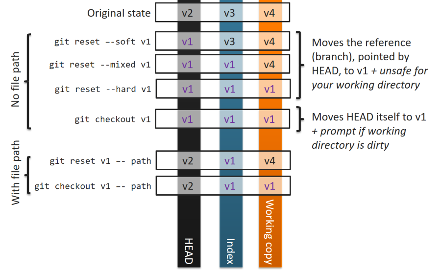

# GIT CHEAT SHEET

[See also the git training page.](./git_training.md)

## Commands

### git config

Sets configuration values for things like your user name, email, and gpg key, your preferred diff algorithm, file formats to use, proxies, remotes and tons of other stuff. For a full list, see the git-config docs (http://www.kernel.org/pub/software/scm/git/docs/git-config.html)

```bash
git help
git config --edit
git config --global --edit
git config --global user.name "User"
git config --global user.email "mymail@truc.com"
git config --global color.ui true # pretty cmd line colors
git config --global core.editor "'C:/Program Files/Notepad++/notepad++.exe' -multiInst -notabbar -nosession -noPlugin"
git config --global core.editor "'C:/data/outils/Sublime Text Build 3126 x64/sublime_text.exe' --wait --new-window"
git config http.proxy http://proxy:8080 # for local repo only
git config user.name # get current value for this property
git config --list
git config --global alias.lol "log --oneline --graph --decorate --abbrev-commit"
git config --global alias.pushall "push --recurse-submodules=on-demand"
git config --global commit.template ~/.gitmessage.txt
git config --global commit.cleanup strip
git config core.hooksPath ~/.githooks
git config core.hooksPath C:/data/repo/_gitlab/GitHooks/hooks
git config --global pull.rebase true # default the pull to fetch + rebase instead of merge
git config --global rerere.enabled true # will remember the conflict resolution and replay them if encountered again
```

### git init

Initializes a git repository – creates the initial `.git` directory in a new or existing project.

Good to know, you can define a new template for the initial .git folder. This allows you to modify the default hooks (for instance).

### git clone

Copies a Git repository from another place and adds the original location as a remote you can fetch from again and possibly push to. if you have permission.

```bash
git clone <url>
git clone <url> <localfolder>
git clone -c key=value <url> <localfolder>
git clone --recurse-submodules <url> # option to clone + init and update all submodules
```

### git add

Adds changes in files in your working directory to your index (=staging area). Equivalent to `git stage`.

```bash
git add -- file.md file2.md # stage new files (add them to the index), use -- to separate file names from potential add options
git add --all
git add -A # same as above, update the index to be equals to the working directory, staging all the tracked and untracked files
git add *.txt # all .txt in current directory
git add "*.txt" # all .txt in project
git add docs/*.txt
```

### git mv

Move or rename a file, directory or symlink

```bash
git mv <source> <dest> # updates the working directory and the index in one go
```

### git rm

Removes files from your index and your working directory so they will stopped being tracked.

```bash
git rm -- README # deleted from the working directory and the index
git rm --cached README # remove the paths only from the index and not from the working directory
```

### git clean

Cleans untracked files from the working directory

```bash
git clean -nd # doesn't clean anything, dry run to see what happens
git clean -fd # clean all including directories
```

### git commit

Takes all of the changes staged in the index (that have been ‘git add’ed), creates a new commit object pointing to it, and advances the branch to point to that new commit.

```bash
git commit # will open the commit message template for you to modify
git commit -m "description" # take a snapshot of the staging area with the given message
git commit -a -m "description" # -a add changes from all tracked files (but new files = untracked are not affected)
git commit --amend -m "new message" # change the last commit (you can specify a new message like here or the previous one will be used by default). What is staged is added to the last commit
git commit -C <sha> # reuse a commit message / author / date
```

*Remember...* : in the commit message you have two parts :

- The subject, which is the first line of the message. It should be short (<50 characters) and contain the issue it fixes
- The body, separated from the subject by an empty line, which contains more details about the commit

### git status

Shows you the status of all the files in your working directory that are not *unmodified*.

It will list out files that are untracked (only in your working directory), modified (tracked but not yet updated in your index), staged (added to your index and ready for committing), deleted and renamed.

```bash
git status # show changes to be commited
git status -sb # shorter version
```

### git branch

Lists existing branches or creates a new branch.

Branches are references, they make commits reachable. Creating a commit is thus a way to nail down part of the graph that you might want to come back to later.

And because neither git merge nor git rebase will change your existing commits (remember, a commit's ID is a hash of its contents and its history), you can create a temporary branch any time you want to try something you're even just a little bit unsure about.

```bash
git branch <branch> # create new branch, pointing to the HEAD commit
git branch <branch> <commit-ish> # can be a commit sha, a branch name, tag
git branch <branch> <remote>/<branch> # create a local branch that tracks a remote branch
git branch -u <remote>/<branch> <branch> # set up the remote branch to track for the local branch (to push/merge)
git branch -u <remote>/<branch> # same for current branch

git branch # list branches
git branch -r # list all remote branches
git branch -a -v # list all branches
git branch -vv # list local branches and reveal the remote branches tracked (if any)
git branch -d <branch> # soft delete / -D for hard delete
git push <remote> :<branch> # delete remote branch
git branch -m <oldname> <newname> # rename branch
git branch -a -v --no-merged # list unmerged branch
```

Unintentional deletion of a branch `git branch -D <branch>` : you can find the last commit of that branch and re-create the branch that points to it.

```bash
git log --walk-reflogs # see the reflog info in full log format
git branch <branch> <sha_of_last_commit>
git checkout
git lol # we got our banch + commits back
```

### git checkout

Switch branches (move the HEAD, update the index and working directory accordingly) or restore files (restore the index and the working tree).

```bash
git checkout <branch> # switch to branch (does not work if your working directory is dirty)
git checkout -b <branch> # creates a branch and moves the HEAD on it, does not modify the working directory or the index
git checkout -b <branch> <commit-ish> # create then switch to branch from a specific commit (does not work if your working directory is dirty)
git checkout -b <branch> <remote>/<branch> # create + switch to the new local branch from origin + track a remote branch
git checkout <branch> # if branch does not exist locally but exists on a remote, it is equals to the command above
git checkout --orphan binaries # creates a new branch without history
```

```bash
git checkout LICENSE # blow away all the changes since last commit
git checkout HEAD -- LICENSE # specify a commit to rollback this file to
git checkout <commit-ish> -- bin/gct-cli.exe # checkout the file from the specified commit
```

### git reset

Update your current branch to make it point to a different commit, optionally updating the index and the working directory accordingly. Can also *unstage* (restore the index for) a given file path.

```bash
git reset file.txt # restore the index with the version file.txt as it is in HEAD
git reset <commit-ish> -- file.txt # specify a different commit than HEAD (default to HEAD)
git reset --soft HEAD^ # undo last commit, updating the current branch to point to the commit BEFORE HEAD = HEAD^, doesn't change the index nor the working directory
git reset --mixed HEAD^ # same as above plus also resets your index to be equal to HEAD^
git reset --hard HEAD^ # same as above plus also resets your working directory to be equal to your index
git reset HEAD~5 # 5 commits ago, defaults to --mixed so it will reset the index as well as the HEAD
git reset --hard origin/master # this makes the local branch strictly equal to the remote branch
git reset <mode> <commit-ish>
```

_git reset mode commit_ :

- --soft : only reset HEAD to commit, leave workdir/index untouched, files are still ready to be commited
- --mixed : + resets the index (modified files are all unstaged)
- --hard : + resets the wordir, all modified files are lost



### git merge

Merges one or more branches into your current branch and automatically creates a new commit if there are no conflicts. When the merge resolves as a fast-forward, only update the branch pointer, without creating a merge commit.

Integrate the changes of a branch into another branch. Makes all the commits of the merged branches reachable by a newly created commit with several parents.

```bash
git merge <ref> # merge ref with your current branch
git merge --no-commit <ref> # does the merge but does not do the final commit, allows you to verify/modify the merge commit even if it has no conflicts
git merge --squash <ref> # allows you to create a single commit on top of the current branch whose effect is the same as merging another branch
git merge -m "" <ref> # specify the new commit message
```

```bash
git status # will list the unmerged files
git commit -a # open the commit editor once you modified the file
```

Vim commands to handle merge commit

```bash
ESC # leave mode
:wq # save and quit
i # insert mode
:qa! # cancel and quit
```

### git rebase

Replay commits on top of another base tip. An alternative to merge that rewrites the commits made since you branched off on top of (after) the current head instead.

```bash
git rebase # will rebase from <remote>/<currentbranch> if it exists
git rebase <branch> # replay the commits reachable from the current branch and not reachable from <branch> on top of <branch>
git rebase <apply_commits_of_this_branch_first> <then_apply_those_commits>
```

1. find the first common ancestor commit of `branch` and `currentbranch` (the first commit reachable from both branch)
2. move all changes of `currentbranch` made since this common commit (=which are not in `branch`) to a temp area
3. resets your `HEAD` to the same commit as `branch`
4. replay all commits in the temp area, one at a time, moving `HEAD` on each new commit replayed

*rebase conflicts :*

```bash
git status # edit unmerged files
git add file.txt # mark as resolved
# (if you selected edit as the rebase operation, you can also make new commits to split this commit)
# touch newfile & git add --all & git commit -m "adding new file"
git rebase --continue # --skip/--abort
```

interactive rebase

```bash
git rebase -i HEAD~3 # alter the last 3 commits of this branch in interactive mode
# it alters every commit AFTER the one you specify, so git rebase HEAD wouldn't do anything
```

*beware :*

Never rebase a public branch (e.g. master, release branch, shared dev branch...). You want to rebase ONTO a local (or single user) branch then merge fast-forward in the public branch! That way, you don't change the history on the public branch, you just fast-forward new commits.

*Scenarii where you want to squash several commits of a feature branch into 1 :*

```bash
# Create the merge request, there are too many commits, we want to squash them manually (gitlab can do that auto though...)
git checkout feat
git rebase -i HEAD~x (squash them)
git push -f
# (pull request has been updated, you only see 1 commit now)
```

*Scenarii where need to rebase your feature branch onto master before merging :*

```bash
# Create the merge request, the feature branch is behind master and needs a rebase (gitlab also does that auto)
git checkout feat
git rebase master
# now we can merge feat on master as a fast forward
# you can just do it on the interface of gitlab
# or do it here
git push -f # push the new changes on feat
git checkout master
git merge -ff feat
# at this point, the pull request should be closed!
```

```bash
# if you go for the merge instead or rebase, force git not to use fast-forward when merging onto master, so you get a merge commit when merging a feature branch, even if you could fast forward it
git checkout master
git merge --no-ff feature_branch
```

#### git merge/rebase with confidence

Use the savepoint pattern described here to merge without the fear of losing things.

In this scenario, I want the changes of _feature_ branch on my _master_ branch.

1. Make sure you're on the right branch and that you have a clean working state, `git status` should show the _master_ branch with nothing to commit
2. Create a new branch to use as a savepoint, but don't switch to it, `git branch feature_savepoint`;  `git status` should still show _master_
3. Do the merge or the rebase
4. Is it OK?
5. **NO** : go back to savepoint `git reset --hard feature_savepoint`
6. **YES** (or clean up) : delete the savepoint `git branch -d feature_savepoint`

*Note* : you don't actually need this in case of a merge, you can just `git reset --hard <commit-ish>` to the commit that was the tip of you branch before the failed merge!

#### git merge versus rebase

**merge** :

- pros : easier, better traceability of the dev (keeps info about the historical existence of a feature branch and its commits)
- cons : history is confusing and you can't revert features easily since they are not packed as a single commit

**rebase** :

- pros : clean history, easy to manipulate commits as they are atomical
- cons : hard than merge and needs a better comprehension of git, you lose info/context on the feature branch (or you keep a stale feature branch), you need to protect shared branches when rebasing or you take the risk to rewrite history on a multi user branch

### git stash

Temporarily saves changes that you don’t want to commit immediately for later. Can re-apply the saved changes at any time.

```bash
git stash # saves all modified and tracked files (staged + non staged), restores the last commit
# it puts the working dir in the same state as a :
git reset --hard HEAD
git stash push # equals git stash
git stash push "ma super modif" # provide a message that will be displayed for this stash
git stash push --keep-index # the staging area is not stashed!
git stash push --include-untracked # also stashes untracked files
git stash list # list the stashed files (the names are in the first column)
git stash list --stat # git stash list can take the same options as the git log
git stash apply <name> # applies a specific stash name, i.e. git stash apply stash@{0}
git stash drop # drops the top stash
git stash pop # equals apply + drop
git stash apply # brings stashed files back without dropping the stash (you can reapply it elsewhere)
git stash show <name> # show details on a particular stack
git stash show # same but default to first stack
git stash show --patch # also accepts any options as git log
git stash branch <branch-name> <stash-name> # checks out a new branch branch and pop the stash
git stash clear # get rid of all stash in the list
```

### git tag

Tags a specific commit with a simple, human readable reference that never moves.

```bash
git tag # list all tags
git tag <tag> # create a new simple tag
git tag <tag> <commit-ish> # create a new simple tag pointing to the given commit
git tag -a -m "description" <tag>  # create a new tag with a message
git push <remote> <tag> # push the tag to a remote
git push <remote> --tags # push all the tags to a remote
git push origin :tagname # delete a tag
```

Contrary to branches, that can point to different commits depending on the local/remote, a tag always point to a particular commit. A remote can have or not have a tag, but if it does, the tag is strictly the same (= points to the same commit) whatever the remote. This is why there is no `<remote>/<tag>`.

### git fetch

Fetches all the objects that a remote version of your repository has that you do not yet so you can merge them into yours or simply inspect them.

Fetching a branch means to get the branch’s head reference from a remote repository, to find out which objects are missing from the local object database, and to get them too.

```bash
git fetch --prune # fetch all the branches and delete obsolete <remote>/<branch> present in your local repo (= fetch + remote prune <remote>)
git fetch --prune-tags # prune local tags not existing in the remote
git fetch --tags # fetch all the distant tags into your repo
```

### git pull

Runs a `git fetch` then a `git merge FETCH_HEAD`.

Use `git pull --rebase` or `git pull --rebase=interactive` to call rebase instead of merge as the 2nd command!

See `pull.rebase`, `branch.<name>.rebase` and `branch.autoSetupRebase` in git-config if you want to make git pull always use --rebase instead of merging.

### git push

Pushes all the objects that you have that a remote version does not yet have to that repository and advances its branches

```bash
git push <remote> <reference>
git push # push the current branch to default remote
git push -u <remote> <branch> # where <branch> is the local branch to push, -u allows to start tracking the local branch
git push <remote> --all # all branches
git push <remote> --tags # all tags
git push <remote> :<ref> # delete remote ref/branch (still need to delete the local branch)
git push <remote> <ref> # links local ref/branch to remote branch = tracking + push
git push <remote> <local_reference><remote_reference> # push the local reference to a remote reference with a different name
```

### git remote

Lists all the remote versions of your repository, or can be used to add and delete them.

```bash
git remote add <name> <url> # add a new remote, with the given remote name
git remote rm <name> # delete a remote
git remote rename <oldname> <name>
git remote -v # list all the remotes and their urls
git remote prune <remote> # clean up (in your local repo) all deleted remote branches
git remote show <remote> # show which branches are tracked for the given remote
```

Create a local (on the local filesystem) repo :

```bash
git init --bare remote.git
git clone remote.git localrepo # clone it
```

### git revert

Revert some existing commits (creates a new commit to cancel an earlier commit).

```bash
git revert [--[no-]edit] [-n] [-m parent-number] [-s] [-S[<keyid>]] <commit>
git revert HEAD~3
```

### git submodule

A parent will point to a specific commit of a submodule. Submodules can be updated as regular git repo inside their parent's repo.

```bash
git submodule add git@example.com:project.git
git submodule update --init --recursive # this will add the submodules to the .git/config + clone + checkout them
```

```bash
git clone git@example.com:myproject_containing_submodules.git
# the submodules will be empty directories, you need to initialise the submodules
git submodule init # goes through the .gitmodules file and adds an entry to .git/config for each submodule
# now we can run update for each submodules which will clone the repo + checkout the specific commit pointed by the parent project
git submodule update # clone + checkout submodule
# OR...
# clone with :
git clone --recurse-submodules <url>
# which is equivalent to :
git clone <url> # plus
git submodule update --init --recursive
```

when pulling a repo with submodules, a module might have been updated (a new commit is pointed)

```bash
git pull
git status # will show the submodule file (project file) has changed
# run update to actually get the changed in the submodule itself
git submodule update
git status # will now show that nothing has to be commited
```

Modify a submodule (commiting on a detached head)

```bash
cd subproject
git status # "not currently on any branch"
git add file.txt
git commit --m "message"
# detached HEAD <sha>
git branch
# * (No branch)
```

The `git submodule update` command checks out submodules in a HEADLESS state.

To attach this commit to a branch :

```bash
git branch <branch> <commit_sha> # to a new branch
# or...
git checkout master
git merge <commit_sha> # merge it into master
```

So when working with submodules, you first have to push the submodule then the parent project. If you forget to push the submodule, the parent will point to a commit that does not exist in the remote repo! To make sure you don't forget :

```bash
git push --recurse-submodules=check # will abort push if a submodule has been forgotten
git push --recurse-submodules=on-demand # will push ALL repositories (even submodules)
git config alias.pushall "push --recurse-submodules=on-demand"
```

### git cherry-pick

Apply the changes introduced by some existing commits.

```bash
git checkout <branch_on_which_to_apply_commit>
git cherry-pick <commit_sha> <commit_sha2> # and so on
# notice that the new commit sha might be different since they might not have the same parent commit!
git cherry-pick --edit <sha> # edit commit message
git cherry-pick --no-commit <sha1> <sha2>... # applies a commit to our working dir but does not commit, allows to combine several commits into one
git cherry-pick -x <sha> # -x adds the source SHA to the commit message (only useful if with remote branches or the source SHA is meaningless!)
git cherry-pick --signoff <sha> # Adds the current user name to the commit message, so we can know who cherry-picked this
```

### git filter-branch

Rewrite branches

```bash
git filter-branch --tree-filter <shell_command> ... # checkout each commit out into working dir, run command and re-commit
git filter-branch --tree-filter 'rm -f password.txt' -- --all # on all commit in all branches
git filter-branch --tree-filter 'rm -f password.txt' -- HEAD # only on current branch
git filter-branch --index-filter 'git rm --cached --ignore-unmatch password.txt' # run command on staging area, git doesn't check out each commit, the command runs on the index
git filter-branch -f --prune-empty -- --all # drops commits that don't alter any files (empty commits)
```

## Inspecting repo

### git diff

Generates patch files or statistics of differences between paths or files in your git repository, or your index or your working directory.

```bash
git diff # show un-staged differences since last commit
git diff --staged # show staged differences since last commit
git diff HEAD # diff between last commit and current state

git diff HEAD^ # parent of latest commit
git diff HEAD^^ # grandparent of latest commit
git diff HEAD~5 # 5 commits ago
```

See also `git help revisions`.

```bash
git diff HEAD^..HEAD
git diff <SHA1>..<SHA2> # all commits reachable from SHA2 that aren’t reachable from SHA1
git diff <branch1> <branch2>
```

### git log

Shows a listing of commits on a branch or involving a specific file and optionally details about what changed between it and its parents.

```bash
git log --pretty=oneline
git log --pretty=format:"%h %ad- %s [%an]"
git log --oneline -p # patch
git log --oneline --stat # stats
git log --oneline --graph # graphical representation
git log --since=1.day.ago
git log --until=1.minute.ago
git log --since=2000-01-01 --until=1.minute.ago
git log master..experiment # all commits reachable from experiment that aren’t reachable from master
git log ^master experiment # same as above (means reachable from experiment but not ^ from master)
git log experiment --not master # same as above
git log master...experiment #  all the commits that are reachable by either of two references but not by both of them
git log --left-right master...experiment # same but you also have the info : if the commit belongs to the left branch or the right branch
```

### git reflog

The hidden log updated anytime HEAD moves (due to new commits, checkout or reset).
The reflog only exists locally, not on the remote repo.

For example, HEAD@{2} means "where HEAD used to be two moves ago", master@{one.week.ago} means "where master used to point to one week ago in this local repository", and so on.

```bash
git reflog
# lost a commit? it is in the reflog, find the associated <SHA> or <reflog_shortname> (i.e. HEAD@{x}) then
git reset --hard <sha>
```

### git blame

Show what revision and author last modified each line of a file

```bash
git blame file.txt --date short
```

### git bisect

Use binary search to find the commit that introduced a bug

### git show

Shows information about a git object, normally used to view commit information.

```bash
git show <object> # blob, commit, tag...
```

### git ls-tree

Shows a tree object, including the mode and name of each node and the SHA-1 value of the blob or tree that it points to. Can also be run recursively to see all subtrees as well.

```bash
git ls-tree <tree-ish> # list the object of a commit for instance
git ls-tree <tree-ish> path
```

### git cat-file

Used to view the type of an object if you only have the SHA-1 value, or used to redirect contents of files or view raw information about any object.

Can be used to see the signature of a commit or a tag :

```bash
git cat-file commit db60657
git cat-file tag v1.0.0
```

If a commit is signed, it will contain :

```text
tree 494c031148f91083db105bcde287562bde846bfb
parent 964a8dc14233f39a8fd4146ac9ebe02a577e1143
author Julien Caillon <julien.caillon@truc.com> 1530694563 +0200
committer Julien Caillon <julien.caillon@truc.com> 1530694563 +0200
gpgsig -----BEGIN PGP SIGNATURE-----
 Version: GnuPG v2
	<HASH>
 -----END PGP SIGNATURE-----

commit message
```

### git grep

Lets you search through your trees of content for words and phrases without having to actually check them out.

### git show-branch

Show branches and their commits

---

## Extra tools

### git hooks

Located in `$GIT_DIR/hooks/*` (or `git config core.hooksPath`)

`git config hooks.allownonascii true`

allows you to use :

```bash
allownonascii=$(git config --bool hooks.allownonascii)
if [ "$allownonascii" != "true" ] then
```

Interesting reading :

- [in french, sry](https://delicious-insights.com/fr/articles/git-hooks/#c-t-client-machine-locale)
- https://git-scm.com/book/en/v2/Customizing-Git-Git-Hooks

### git archive

Creates a tar or zip file of the contents of a single tree from your repository. Easiest way to export a snapshot of content from your repository.

### git gc

Garbage collector for your repository. Packs all your loose objects for space and speed efficiency and optionally removes unreachable objects as well. Should be run occasionally on each of your repos.

### git fsck

Does an integrity check of the Git “filesystem”, identifying dangling pointers and corrupted objects.

### git prune

Removes objects that are no longer pointed to by any object in any reachable branch.

### gitk

Graphical Tcl/Tk based interface to a local Git repository.

### instaweb

Wrapper script to quickly run a web server with an interface into your repository and automatically directs a web browser to it

### git-daemon

Runs a simple, unauthenticated wrapper on the git-upload-pack program, used to provide efficient, anonymous and unencrypted fetch access to a Git repository.