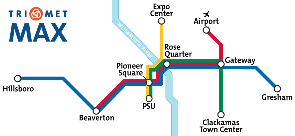
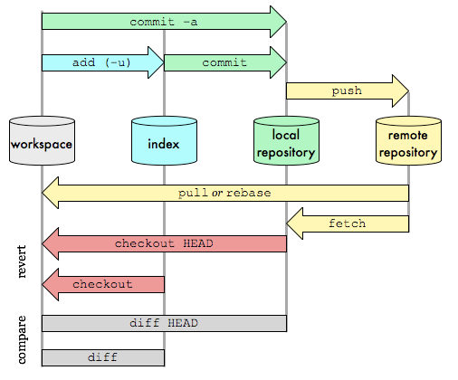

# HOW TO... GIT

## About GIT

- decentralized, every copy of a repository contains the entire history of changes
- no one (or everyone) has the source of truth!
- you can synchronize repos when working together
- it stores differentials of files, not all the whole file at each point of history
- awesome conception, great performances, bravo Linus Torvalds (created in 2005)

### How to organize a version control system

Basic need :

- we have some files that represent our application
- we want to be able to save the state of all the files of our application at a given time (= take a snapshot)
- we want to be able to go back to a past state
- for a given state, we need an history of all the modifications that lead to this state
- (we would also like to synchronize our work with others to work together on the same project)

Sounds like a perfect job for... a graph!

## Graph theory

A graph refers to a collection of nodes and a collection of edges that connect pairs of nodes.

>> Places to go, and ways to get there.

### Places to go and how to get there

SEVEN BRIDGES OF KÖNIGSBERG :

Is it possible to walk through the city and cross every bridge exactly once?


Euler threw away all the information that didn't matter to the problem.


Each land mass can be represented by a point, and each bridge is just a line between two points.

>> A graph refers to a collection of nodes and a collection of edges that connect pairs of nodes.

- Nodes: Places to be
- Edges: Ways to get there

### Attaching labels to nodes

Because it's more convenient!



Why are those lines different colors?

### Attaching labels to edges


We can attach all kind of info to an edge. Like a direction for instance.

### Directed graphs


### Reachability


- Time flows from LEFT to RIGHT
- If you start from E, the history you'll see is A, B, C, D, E
- If you start from K, the history you'll see is A, B, C, I, J, K

**Depending on which node you start with, some parts of the graph will be unreachable to you!**

## Graphs... and GIT

### Keep an history of changes = git uses graphs

>> for a given state, we need an history of all the modifications that lead to this state


We use a directed graph. From a node, I am able to know the whole history of nodes that lead to this particular node.

In GIT, a node represents the state of our source directory. To go from one state to another, we apply some modifications to our source directory. From any node in the graph, we can know which modifications lead to our current state.

*We have answered our first need with a graph!*

### Take a snapshot at any given time = commit

>> we want to be able to save the state of all the files of our application at a given time (= take a snapshot)

We have an history of state (or history of "snapshots") for our application, but we don't know how to save this state (= take this snapshot) yet...

In GIT, taking a snapshot is called staging (the add command) + committing (the commit command).


Git has 3 areas :

- the workspace is the directory tree of (source) files that you see and edit
- the index is where you place files you want to be part of the next commit. It is a single, large, binary file in .git/index, which lists all files in the current branch, their sha1 checksums, time stamps and the file name -- it is not another directory with a copy of files in it!
- the local repository is a hidden directory (.git) including an objects directory containing all versions of every file in the repo (local branches and copies of remote branches) as compressed "blob" files


*Why the 2 stage process?*

You are fixing a bug that requires to modify 1 line. When correcting this issue, you notice another bug that forbids you to test your original bug. You correct both, do your unit test. But you don't want a single commit for 2 separate issues! No problem, stage the first file, commit, then stage the second file and commit again -> you have 2 commits!

### What does adding a commit mean for our graph

When we commit, we add a new state to our history = we add a new node to our graph. The current state always follows a previous state so we can have an history of state.

We add the green node which follows the grey one. The green node is a child of the grey node. The grey node is a parent of the green node.


[Interactively add a commit](https://onlywei.github.io/explain-git-with-d3/#commit)

Cool, but at the moment, we have a **linear** history. It would be call to have **branches** in our graph. We could work on several independent features.

----

**A commit in GIT is represented by a SHA1 hash value.**

The anatomy of a commit :

```js
sha1(
    commit message  => "initial commit"
    committer       => "Julien Caillon <julien.caillon@gmail.com>"
    commit date     => Sat Nov 8 10:56:57 2017 +0100
    author          => "Julien Caillon <julien.caillon@gmail.com>"
    author date     => Sat Nov 8 10:56:57 2017 +0100
    tree            => 9c435a86e664be00db0d973e981425e4a3ef3f8d
)
```

The tree object :


----

### Bonus feature : branches

We want something like that :


One slight problem, we now need to specify the "previous" node when we commit. SHA1 = 40 characters...

Remember how we can **label nodes**? Let's do that.


Now i can add my new commit to either the `dev` or `master` node.

Also, if I talk about the `dev` **branch** of the graph, we all know what i'm talking about. Same for `master`.

>> By naming a node, we also identify a **branch** which is composed of all the parent nodes of the named node!

Labelling a node in GIT is called adding a reference. **The label of a node is called a reference.**

Because the name of a branch is actually the name of the *last commit* on a branch, branches are also called *heads*. Because a branch reference is a reference to the commit which is the *head* of a branch. Makes sense?

When we add a new commit to a branch, git conveniently MOVES the branch label to the commit we just added : [demo now](https://onlywei.github.io/explain-git-with-d3/#branch).

GIT also defines a special reference which is `HEAD`. The `HEAD` is just another convenient way to describe the current branch we are working on :

- First we position the `HEAD` on a given branch
- Then we can directly create a commit, without specifying the branch name
- The commit is added to the branch **pointed** by the `HEAD`

[Time for a demo](https://onlywei.github.io/explain-git-with-d3/#branch)





| path | function |
|---------------------|-----------------------------|
| hooks/\*.sh | executable scripts started on git actions (like git checkout or git commit) |
| info/exclude | same function as .gitignore, allows to describe files/folders that should not be committed to the repo |
| logs/ | for each branch of the repo, keep a log on how the head (tip) of a branch moved |
| objects/ | the object database, were git store every piece of data committed as a key-value data store. Note that if you concat the sub folder name (2 chars) + any file name in this sub folder (38) you get the hash that should be used to address this object (eg 65/142965161d014c8e8bfd77fee6d41cea257adb). |
| refs/ | contains the references. Contains files containing HASH of the commit they link to. |
| config | the local (only for this repo) config file |
| description | description of the repo... kind of useless nowadays | 
| HEAD | contains either a commit HASH or the name of a reference that is currently checked out |
| index | The index is a binary file (generally kept in .git/index) containing a sorted list of path names, each with permissions and the SHA1 of a blob object; git ls-files can show you the contents of the index |
| packed-refs | not always present, same function as the refs folder expect that all the info are in one file which is better for a performance perspective |

```bash
git branch
# * master
ls .git/refs/heads/
# master
cat .git/refs/heads/master
# <commit_sha>
cat .git/HEAD
# ref: refs/heads/master
cat .git/packed-refs
# dd452f4ee5ee2d3860f211af5f4bf14372acb198 refs/remotes/origin/3.0.0/ft/issue2
# sometimes, branches/tags/remotes are stored in the .git/packed-refs instead of the usual refs/ directory
# this is for performances (1 file instead of 100), you can force pack with git pack-refs --all
```