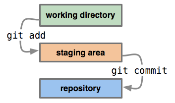

# HOW TO... GIT

## About GIT

- fully distributed = decentralized, every copy of a repository contains the entire history of changes, no one (or everyone) has the source of truth!
- you can synchronize repos when working together
- it supports non-linear developments (parallel branches)
- it handles very large projects really efficiently
- beside deleting the whole repository, it is impossible to unintentionally lose any data that git knowns about
- awesome conception, great performances, bravo Linus Torvalds (created in 2005)

## How could we create a version control system

Basic needs :

- we have some files that represent our application (in a source directory)
- we want to be able to record the state of the source directory at a given time (= take a snapshot)
- we want to be able to go back to a past state
- for a given state, we need an history of all the previous states (= the modifications that lead to this state)

Sounds like a perfect job for... a graph!

## Graph theory

A graph refers to a collection of nodes and a collection of edges that connect pairs of nodes.

### Places to go and how to get there

SEVEN BRIDGES OF KÖNIGSBERG :

Is it possible to walk through the city and cross every bridge exactly once?


Euler threw away all the information that didn't matter to the problem. The graph theory was born.


Each land mass can be represented by a point, and each bridge is just a line between two points.

> A graph represents places to go, and ways to get there

- Nodes: Places to be
- Edges: Ways to get there

### Attaching labels to nodes

Because it's more convenient!


But why are those lines different colors?

### Attaching labels to edges


We can attach all kind of info to an edge. Like a direction for instance.

### Directed graphs


From a given node, we are not allowed to follow any edge, we must respect the given direction.

### Reachability


Following the directions...

- If you start from E, the history you'll see is A, B, C, D, E
- If you start from K, the history you'll see is A, B, C, I, J, K

> This also means that, **in a directed graph**, depending on which node you start with, **some parts of the graph will be unreachable to you!**

If I start from K, I can never reach E.

### Common ancestor

In our previous graph...

> B is the first **common ancestor** of H and K

## Graphs... and GIT

All that graph theory to say what?

### Keep an history of changes = git uses graphs

The requirement was : *For a given state, we need an history of all the previous states*

Sounds like we could use a directed graph. From a node, I am able to know the whole history of nodes that lead to this particular node.

In GIT, a node represents the state of our source directory. To go from one state to another, we apply some modifications to our source directory. From any node in the graph, we can know which modifications lead to our current state.

> In GIT, a node = the state (snapshot) of our source directory at a given time
> Add a state (snapshot) = add a new node to our graph

The current state always follows a previous state so we can have an history of state (this is why our graph is directed).


We add the green node which follows the grey one. The green node is a child of the grey node. The grey node is a parent of the green node.

[Let's add a new commit and see how it modifies our graph](https://onlywei.github.io/explain-git-with-d3/#commit)

### Take a snapshot = save the state of our sources = commit

The second requirement was : *we want to be able to save the state of our source directory at a given time (= take a snapshot)*

We have an history of state (or history of "snapshots") for our application, but we don't know how to save this state (= take this snapshot) yet...

In GIT, taking a snapshot is called staging (the add command) + committing (the commit command).



*We first have to take our top models (aka files) up to the stage before taking a photo (aka commit).*

> In GIT, a file has 3 main states : committed / staged / modified

- Committed means that the data is safely stored in your local database
- Modified means that you have changed the file but have not committed it to your database yet
- Staged means that you have marked a modified file in its current version to go into your next commit snapshot

Git has 3 areas :


- the workspace is your source directory. It is a single checkout of **one version** of the project. These files are pulled out of the compressed database in the Git directory and placed on disk for you to use or modify
- the index (or staging area) is where you place files you want to be part of the next commit. It is a single, large, binary file in .git/index, which lists all files in the current branch, their sha1 checksums, time stamps and the file name
- the local repository is a hidden directory (.git) located in your source directory, including an `objects` sub directory containing all versions of every file in the repo as compressed "blob" files as well as metadata to find those objects

#### Why the 2 stage process

*Why committing takes 2 actions?*

You are fixing a bug that requires to modify 1 line. When correcting this issue, you notice another bug that forbids you to test your original bug. You correct both, do your unit test. But you don't want a single commit for 2 separate issues! No problem, stage the first file, commit, then stage the second file and commit again -> you have 2 commits!

This also works if you have to modify the same file but you have to stage your file after the first modification, fix the second modification, test, commit (only the 1st will be committed), stage the file and commit again (to commit the 2nd modification).

#### Tracked and untracked files

Beside being either committed/staged/modified, can also be in 1 of the 4 following states.


- Tracked files : Git knows about those files, it has been added in or since the last commit, they can be...
  - unmodified = identical to last commit, this is the default state of a file after a checkout
  - modified = present in last commit but has been modified since
  - staged = has been added to the staging area and marked to be part of the next commit
- Untracked files : everything else, the file was never been added or has been removed since the last commit

For tracked files, you can check the status of each file with `git status`.

For tracked files, you can check the content of what will be pushed in the next commit (staged content) with `git diff --staged` and also check the modified content (unstaged content) with `git diff`.

#### What exactly is a commit in GIT

> Conceptually, Git doesn’t store data as a series of changesets or differences, but instead as a series of snapshot
> A commit in GIT is represented by a unique identifier, a `SHA1` hash value

The anatomy of a commit :

```js
sha1(
    commit message  => "initial commit"
    committer       => "Julien Caillon <julien.caillon@gmail.com>"
    author          => "Julien Caillon <julien.caillon@gmail.com>"
    tree            => 9c435a86e664be00db0d973e981425e4a3ef3f8d
    parentCommits   => [9c435a86e664be00db0d973e981425e4a3ef3f8d, ...]
)
```


When staging a file, its checksum SHA1 is computed and its data is stored as a blob. The SHA1 is stored in the index (staging area).

When committing, the tree object is computed and also its checksum, which is used in the commit SHA1 computation.

> We can also see that the parent commit is part of the commit SHA1

Cool, but at the moment, we have a **linear** history. It would be call to have **branches** in our graph. We could work on several independent features.

### GIT branching

We want something like that :


We can just add our next commit to the last commit of the 2 branches. One slight problem, we now need to specify the "previous" node when we commit. SHA1 = 40 characters...

Remember how we can **label nodes**? Let's do that.


Now I can add my new commit to either the `dev` or `master` node.

Also, if I talk about the `dev` **branch** of the graph, we all know what I'm talking about. Same for `master`.

> By naming a node, we also identify a **branch** which is composed of all the parent nodes of the named node!

Remember than a node in our graph is a commit.

> Labelling a node in GIT is called adding a **reference** to a commit. **Such label is called a reference.**
>
> There are two types of references in GIT : tags (static) and branches (dynamic)

A tag marks an important point in history, it designates a commit (this is the definition of a reference) and it is *static*. Static in the sense that you affect a tag to a commit and it will always stay on this particular commit.

Branches however, are *dynamics*. When we add a new commit to a branch, git conveniently *moves* the branch reference to the commit we just added.

[Let's illustrate how the branch reference moves when we add a new commit](https://onlywei.github.io/explain-git-with-d3/#branch).

Because the name of a branch is actually associated with the *last commit* (i.e. the *head* commit) of the branch, branches are also called *heads*. Think of heads (in lower case!) as an alias for branches.

FYI, The last commit of a branch, or head commit is also known as the *tip of the branch*.

#### The link between a commit on our graph and the actual files in our workspace

How do I know which commit (= revision) is currently checked out in my workspace?

Remember that we said our workspace (or working copy, or our source directory) was a checkout of one version of our app? One version = one commit = one revision, they are all synonyms.

GIT defines a special reference which is called `HEAD` (in caps!).

To always know which commit was initially checked out (what our workspace represents), we have this reference `HEAD` that points to a the checked out commit.

If we checked out a branch instead of a commit, the `HEAD` points to the branch reference instead of pointing directly to the commit. This means that if our branch reference moves, the `HEAD` moves with it!

[Let's illustrate how the HEAD follows the current branch reference when we add a commit](https://onlywei.github.io/explain-git-with-d3/#branch).

The `HEAD` reference is also implicitly used in many commands, which simplify their calls. For instance, when committing, you never specify the branch on which to add the new commit. It simply adds it to the `HEAD`.

- First we position the `HEAD` on a given branch
- Then we can directly create a commit, without specifying the branch name
- The commit is added to the branch **pointed** by the `HEAD`

> The `HEAD` is the most important reference in GIT, it represents the branch or commit currently checked out
>
> It points to a commit or a branch
>
> In the case of a branch, it moves with the branch on new commits


#### Detached HEAD and headless commits

If we checkout a commit #1, the `HEAD` points to a commit #1.

> If you check out a commit instead of a branch you are in a **detached `HEAD`** state

What if we try to add a commit to this `HEAD`?
It adds the new commit #2 with the parent being the commit #1 and then the `HEAD` is moved to that new commit #2.


However...

If I then checkout an existing branch (say master on this example), I can't go back to commit #1 unless I know the commit SHA1! This is because I didn't attach a reference to that commit.

> The commit #2 (5605226...) is called **headless**. He is not **reachable** from any reference in our graph

FYI, you will probably not know the SHA1 of a commit you left behind that way. Fortunately, git has a special log that keeps track of all the movements of the `HEAD`. This log is called the `reflog` and you will be able to get the SHA1 of the commit #2 using `git reflog`.

### Understand everything else

Now we have all the vocabulary and the intellectual tools to understand all the GIT commands, how awesome is that?

----

> we would also like to synchronize our work with others to work together on the same project


| path | function |
|---------------------|-----------------------------|
| hooks/\*.sh | executable scripts started on git actions (like git checkout or git commit) |
| info/exclude | same function as .gitignore, allows to describe files/folders that should not be committed to the repo |
| logs/ | for each branch of the repo, keep a log on how the head (tip) of a branch moved |
| objects/ | the object database, were git store every piece of data committed as a key-value data store. Note that if you concat the sub folder name (2 chars) + any file name in this sub folder (38) you get the hash that should be used to address this object (eg 65/142965161d014c8e8bfd77fee6d41cea257adb). |
| refs/ | contains the references. Contains files containing HASH of the commit they link to. |
| config | the local (only for this repo) config file |
| description | description of the repo... kind of useless nowadays | 
| HEAD | contains either a commit HASH or the name of a reference that is currently checked out |
| index | The index is a binary file (generally kept in .git/index) containing a sorted list of path names, each with permissions and the SHA1 of a blob object; git ls-files can show you the contents of the index |
| packed-refs | not always present, same function as the refs folder expect that all the info are in one file which is better for a performance perspective |

```bash
git branch
# * master
ls .git/refs/heads/
# master
cat .git/refs/heads/master
# <commit_sha>
cat .git/HEAD
# ref: refs/heads/master
cat .git/packed-refs
# dd452f4ee5ee2d3860f211af5f4bf14372acb198 refs/remotes/origin/3.0.0/ft/issue2
# sometimes, branches/tags/remotes are stored in the .git/packed-refs instead of the usual refs/ directory
# this is for performances (1 file instead of 100), you can force pack with git pack-refs --all
```

----

## Sources

- https://git-scm.com/book/en/v2
- http://onlywei.github.io/explain-git-with-d3/#branch
- http://marklodato.github.io/visual-git-guide/index-en.html
- http://think-like-a-git.net
- https://github.com/pluralsight/git-internals-pdf/releases
- https://speakerdeck.com/lemiorhan/10-git-anti-patterns-you-should-be-aware-of
- https://www.atlassian.com/git/tutorials/what-is-version-control
- http://shafiulazam.com/gitbook/1_the_git_object_model.html