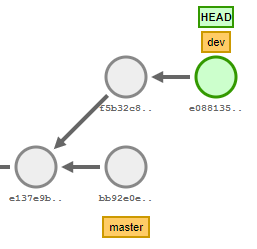
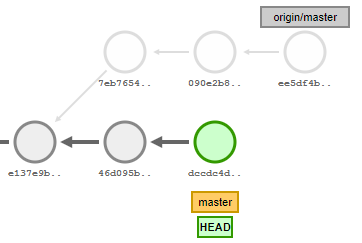

# HOW TO... GIT

## About GIT

- fully distributed = decentralized, every copy of a repository contains the entire history of changes, no one (or everyone) has the source of truth!
- you can synchronize repos when working together
- it supports non-linear developments (parallel branches)
- it handles very large projects really efficiently
- beside deleting the whole repository, it is impossible to unintentionally lose any data that git knowns about
- awesome conception, great performances, bravo Linus Torvalds (created in 2005)

## How could we create a version control system

Basic requirements :

- we have some files that represent our application (in a source directory)
- we want to be able to record the state of the source directory at any given time (= take a snapshot)
- for a given state, we need an history of all the previous states
- we want to be able to go back to a past state (= to **checkout** any previous state)

Sounds like a perfect job for... a graph!

## Graph theory

### Places to go and how to get there

SEVEN BRIDGES OF KÖNIGSBERG :

Is it possible to walk through the city and cross every bridge exactly once?


Euler threw away all the information that didn't matter to the problem. The graph theory was born.

A graph refers to a collection of nodes and a collection of edges that connect pairs of nodes.


Each land mass can be represented by a point, and each bridge is just a line between two points.

> A graph represents places to go, and ways to get there

- Nodes: Places to be
- Edges: Ways to get there

### Attaching labels to nodes

Because it's more convenient!


But why are those lines different colors?

### Attaching labels to edges


We can attach all kind of info to an edge. Like a direction for instance.

### Directed graphs


From a given node, we are not allowed to follow any edge, we must respect the given direction.

### Reachability


Following the directions...

- If you start from E, the history you'll see is A, B, C, D, E
- If you start from K, the history you'll see is A, B, C, I, J, K

> This also means that, **in a directed graph**, depending on which node you start with, **some parts of the graph will be unreachable to you!**

If I start from K, I can never reach E.

### Common ancestor

In our previous graph...

> B is the first **common ancestor** of H and K

## Graphs... and GIT

All that graph theory to say what?

### Keep an history of changes = git uses graphs

The requirement was : *For a given state, we need an history of all the previous states*

Sounds like we could use a directed graph to represent our state history. From a node, I am able to know the whole history of nodes that lead to this particular node.

In GIT, a node represents the state of our source directory. From any node in the graph, we can know the previous state of our source directory.

> In GIT, a node = the state (snapshot) of our source directory at a given time
>
> Adding a state (snapshot) = adding a new node to our graph

The current state always follows a previous state so we can have an history of state (this is why our graph is directed).


We add the green node which follows the grey one. The green node is a child of the grey node. The grey node is a parent of the green node.

### Take a snapshot = save the state of our sources = commit

The second requirement was : *we want to be able to save the state of our source directory at a given time (= take a snapshot)*

We have an history of state (or history of "snapshots") for our application, but we don't know how to save this state (= take this snapshot) yet...

In GIT, taking a snapshot is called committing. A snapshot is a commit.

[Let's add a new commit and see how it modifies our graph](https://onlywei.github.io/explain-git-with-d3/#commit)

The commit operation actually happens in two parts : staging (the add command) + committing (the commit command).


> In GIT, a file can be : committed / staged / modified

- Committed means that the data is safely stored in your local git "database"
- Modified means that you have changed the file but have not committed it to your database yet
- Staged means that you have marked a modified file in its current version to go into your next commit snapshot

Mirroring the 3 file states, Git also has 3 areas :


- **the workspace** (aka work area or work directory) is the directory that holds the current checkout of the files you are working on. It is a single checkout of **one version** of the project. These files are pulled out of the compressed database in the Git directory and placed on disk for you to use or modify
- **the index** (or staging area) is where you place files you want to be part of the next commit. It is a single, large, binary file in .git/index, which lists files with their sha1 checksums, time stamps and the file name
- **the local repository** is your local "database". It is actually a hidden directory (.git), including an `objects` sub directory containing all versions of every file in the repo as compressed "blob" files as well as metadata to find those objects

#### Why the 2 stage process

But why committing takes 2 actions?

You are fixing a bug that requires to modify 1 line. When correcting this issue, you notice another bug that forbids you to test your original bug. You correct both, do your unit test. But you don't want a single commit for 2 separate issues! No problem, stage the first file, commit, then stage the second file and commit again -> you have 2 commits!

This also works if you have to modify the same file but you have to stage your file after the first modification, fix the second modification, test, commit (only the 1st will be committed), stage the file and commit again (to commit the 2nd modification).

> The work area is a real sandbox where we try any modifications of our source code. Without the staging area, we would only be allowed to modify, in our work area, files that are destined to be in the next commit

#### Tracked and untracked files

Beside being either committed/staged/modified, can also be in 1 of the 4 following states.


- Tracked files : Git knows about those files, it has been added in or since the last commit, they can be...
  - unmodified = identical to last commit, this is the default state of a file after a checkout
  - modified = present in last commit but has been modified since
  - staged = has been added to the staging area and marked to be part of the next commit
- Untracked files : everything else, the file has never been added or has been removed since the last commit

You can check the status of each file with `git status -u`.

For tracked files, you can check the content of what will be pushed in the next commit (staged content) with `git diff --staged` and also check the modified content (unstaged content) with `git diff`.

#### What exactly is a commit in GIT

> Conceptually, Git doesn’t store data as a series of changesets or differences, but instead as a series of snapshot
>
> A commit in GIT is represented by a unique identifier, a `SHA1` hash value

The anatomy of a commit :

```js
sha1(
    commit message  => "initial commit"
    committer       => "Julien Caillon <julien.caillon@gmail.com>"
    author          => "Julien Caillon <julien.caillon@gmail.com>"
    tree            => 0de249c435a86e664be00db0d973e981425e4a3e
    parentCommits   => [9c435a86e664be00db0d973e981425e4a3ef3f8d, ...]
)
```


When staging a file, its checksum SHA1 is computed and its data is stored as a blob. The SHA1 is stored in the index (staging area).

Here is an example of the content of this index file :

```bash
$ git ls-files --stage
100644 41a0f2a5a7bae99c699bfa48d424111cd8bb0591 0       .gitattributes
100644 26d58b650bb57fa5ff2d1f123a09c3b08e242890 0       .gitconfig
100644 dbd92ba288c72f2f9ecae5f6333788471f62a6ef 0       .gitignore
100644 0dd65d7b42a5a4a841796a9e3e0fcb64a6db44e2 0       .gitmessage.txt
100644 57b6318319f7973b311b9342573bb59679fb779b 0       git.md
100644 587abb138ac2aaf29690dfed4550f8832334ef32 0       git_training.md
100644 7c49b1d3129d954152d5973c77a53ad0e57bb190 0       images/2018-07-04-09-58-28.png
100644 2a73e355cffb6377616b3ebac1585a1250956001 0       images/2018-09-11-17-19-06.png
...
```

When committing, the tree object is computed from the index and its SHA1 checksum is used in the commit.

> We can also see that the parent commit is part of the commit SHA1

Cool, but at the moment, we have a **linear** history. It would be call to have **branches** in our graph. We could work on several independent features.

### GIT branching

We want something like that :


We can just add our next commit to the last commit of the 2 branches. One slight problem, we now need to specify the "previous" node when we commit. SHA1 = 40 characters...

Remember how we can **label nodes**? Let's do that.


Now I can add my new commit to either the `dev` or `master` node.

Also, if I talk about the `dev` **branch** of the graph, we all know what I'm talking about. Same for `master`.

> By naming a node, we also identify a **branch** which is composed of all the parent nodes of the named node!

Remember than a node in our graph is a commit.

> Labelling a node in GIT is called adding a **reference** to a commit. **Such label is called a reference.**
>
> A reference is a pointer to a commit
>
> There are two types of references in GIT : tags (static) and branches (dynamic)

A tag marks an important point in history, it designates a commit (this is the definition of a reference) and it is *static*. Static in the sense that you affect a tag to a commit and it will always stay on this particular commit.

Branches however, are *dynamics*. When we add a new commit to a branch, git conveniently *moves* the branch reference to the commit we just added.

[Let's illustrate how the branch reference moves when we add a new commit](https://onlywei.github.io/explain-git-with-d3/#branch).

[Also show the git tag command](https://onlywei.github.io/explain-git-with-d3/#branch).

Because the name of a branch is actually associated with the *last commit* (i.e. the *head* commit) of the branch, branches are also called *heads*. Think of heads (in lower case!) as an alias for branches.

FYI, The last commit of a branch, or head commit is also known as the *tip of the branch*.

#### The link between a commit on our graph and the actual files in our workspace

How do I know which commit (= revision) is currently checked out in my workspace?

Remember that we said our workspace (or working copy, or our source directory) was a checkout of one version of our app? One version = one commit = one revision, they are all synonyms.

GIT defines a special *symbolic* reference which is called `HEAD` (in caps!).

To always know which commit was initially checked out (what our workspace represents), we have this reference `HEAD` that points to a the checked out commit.

If we checked out a branch instead of a commit, the `HEAD` points to the branch reference instead of pointing directly to the commit, hence the *symbolic* reference. This means that if our branch reference moves, the `HEAD` moves with it!

[Let's illustrate how the HEAD follows the current branch reference when we add a commit](https://onlywei.github.io/explain-git-with-d3/#branch).

The `HEAD` reference is also implicitly used in many commands, which simplify their calls. For instance, when committing, you never specify the branch on which to add the new commit. It simply adds it to the `HEAD`.

- First we position the `HEAD` on a given branch
- Then we can directly create a commit, without specifying the branch name
- The commit is added to the branch **pointed** by the `HEAD`

> The `HEAD` is the most important reference in GIT, it represents the branch or commit currently checked out
>
> It points to a commit or a branch
>
> In the case of a branch, it moves with the branch on new commits


#### Detached HEAD and headless commits

If we checkout a commit #1, the `HEAD` points to a commit #1.

> If you check out a commit instead of a branch you are in a **detached `HEAD`** state

What if we try to add a commit to this `HEAD`?
It adds the new commit #2 with the parent being the commit #1 and then the `HEAD` is moved to that new commit #2. No branch reference gets updated.


However...

If I then checkout an existing branch (say master on this example), I can't go back to commit #1 unless I know the commit SHA1! This is because I didn't attach a reference to that commit.

> The commit #2 (5605226...) is called **headless**. He is not **reachable** from any reference in our graph
>
> A reference makes a commit reachable

FYI, you will probably not know the SHA1 of a commit you left behind that way. Fortunately, git has a special log that keeps track of all the movements of the `HEAD`. This log is called the `reflog` and you will be able to get the SHA1 of the commit #2 using `git reflog`.

When a commit is not reachable, GIT makes it garbage collectible. Of course, GIT doesn't get rid of it right away so you can easily add a reference to it if needed. You can force the use of the garbage collector with `git gc`.

### Visualize the process of a commit on the graph and the 3 trees

The 3 trees (i.e. collection of files) :

- HEAD : a snapshot of the last commit of your branch and the parent of the upcoming commit
- Index : what will be in your next commit
- Working Directory : a sandbox where you can try changes before adding them to the index and committing them to history

```sh
git init
touch file.txt
```

> At this point, master it an **orphan** branch, it has no parent commit


```sh
git add file.txt
```


```sh
git commit -m "first commit"
```


```sh
git status # nothing to commit, working tree clean (all 3 files are the same)
echo "truc" > file.txt
git status # Changes not staged for commit : file.txt (index differs from work area)
```


```sh
git add file.txt
git status # Changes to be committed : file.txt (HEAD differs from index)
```


```sh
git commit -m "second commit"
git status # nothing to commit, working tree clean
```


## Understand everything else

Now we have all the vocabulary and the intellectual tools to understand all the GIT commands, how awesome is that?

### Git help

```bash
git help <command>
git <command> -h
```

### Git branch

What does *creating a branch* mean? ... Adding a branch reference to a commit ... Adding a label to a node.

> List, create or delete branches

```bash
git branch # list local branches
git branch <branch> # create new branch from the current HEAD
git branch <branch> <commit-ish> # create a new branch from a commit sha1, a branch name or a tag
git branch -d <branch> # soft delete a branch / -D for hard delete
```

[Interactively create a branch, delete it, show how it simply labels a commit](https://onlywei.github.io/explain-git-with-d3/#branch)

### Git checkout

> Switch branches and/or restore index + working tree files

This command has two form, one with and one without a file path.

#### Git checkout without a file path

This is used to "switch" branches. This command affects the 3 trees. It updates the `HEAD` to point to a new reference, updates the index with the current `HEAD` and finally update the working directory with the index.

We have the following situation and we do `git checkout feature` :


First, it updates the `HEAD` to point to a new reference (the checked out branch or commit) :


Then it makes the Index equals to `HEAD` (Remember that the index is "what will be added in the upcoming commit". When you just checked out a branch, you expect that nothing will be in the next commit, everything is already committed) :


Finally, it makes the Working Directory look like the Index :


It's a **safe** command, in the sense that if your working directory is **dirty** (i.e. has modified files), git will not let you checkout.

This is because a checkout is a destructive command for the working directory, your modifications would be override by a checkout.

```bash
git checkout <branch> # switch to branch (does not work if your working directory is dirty)
git checkout -b <branch> # creates a branch and moves the HEAD on it, does not modify the working directory or the index
git checkout -b <branch> <commit-ish> # create then switch to branch from a specific commit (default to HEAD, does not work if your working directory is dirty)
git checkout <commit-ish> # the command actually accepts a commit-ish, allowing you to checkout any commit
```

> A commit-ish is a commit or a tag reference or a branch reference : basically anything that git can turn into a SHA1

[Interactively show how the checkout command moves the HEAD pointer to either a reference or a commit](https://onlywei.github.io/explain-git-with-d3/#checkout)

#### Git checkout with a file path

The checkout command with a file path updates the index and the working directory with the version of a file from a given commit.

We have the following situation and we do `git checkout -- file.txt` :


The index is updated to have the version of the file as it is in HEAD :


And then the working directory is updated with the file referred in the index :


```bash
git checkout myfile.txt # blow away all the changes since last commit (HEAD)
git checkout <commit-ish> -- myfile.txt # specify a commit to rollback this file to
```

*Demo on a real git repo.*

```bash
git init
touch file.txt
git add file.txt
git commmit -m "ok"
edit file.txt
git add file.txt
git status
git checkout -- file.txt
git status
```

### Git reset


What should I do on the graph above if I want to abandon the last commit I made?

I should move the master reference to the previous commit (`HEAD`  will follow master).

> `git reset` can make the current **branch** points to a different commit

[Interactively show how the command moves the branch reference (and how HEAD follows)](https://onlywei.github.io/explain-git-with-d3/#reset)

Again, this command has two form, one with and one without a file path.

#### Git reset without a file path

It *can* affects the 3 trees.

- Step 1 : it makes the `HEAD` and the branch associated with `HEAD` point to a specified commit (= it modifies the branch reference to point to another commit!)
- Step 2 : (optional) it updates the index to be equals to HEAD
- Step 3 : (optional) it updates the working directory to be equals to the index

```bash
git reset <mode> <commit-ish>
```

3 modes :

- --soft : resets HEAD to given commit
- --mixed (default) : same as soft + resets the index
- --hard : same as mixed + resets the working directory

*Workflow of the reset command :*

Initial situation :


If the chosen mode is `--soft`, it stops after this step : `git reset --soft 9e5e6a4`


If the chosen mode is `--mixed`, it stops after this step : `git reset --mixed 9e5e6a4` or simply `git reset 9e5e6a4`


In `--hard` reset mode, we also do this step : `git reset --hard HEAD~`


With the 3 options (--hard), this is almost equals to a `git checkout`! Almost because the checkout command only makes the `HEAD` point to another reference, it doesn't actually change the branch reference! Also, checkout is safe because if the working directory is dirty, the command fails. Reset however, will just discard all your modifications without warnings.

*Difference between checkout and reset :*


Extra tips, reference commits relative to a known commit ([see git help revisions](https://git-scm.com/book/en/v2/Git-Tools-Revision-Selection)) :

```bash
git reset HEAD^ # ancestry reference - parent of latest commit
git reset <branch>^^ # grandparent of latest commit of the branch
git reset HEAD~5 # 5 commits ago in the current branch
giy reset HEAD@{2} # (reflog shortname) where the HEAD was 2 moves ago
giy reset master@{one.week.ago} # where master used to point one week ago
```

#### Git reset with a file path

The command with a file path does not modify where the `HEAD` points to. It can only affect the index for a given file.

Why not 3 modes?

- The `--hard` mode would be strictly equal to a `git checkout` with a file path.
- The `--soft` mode would not make sense because we don't want to update the `HEAD` when we target a file path...

```bash
git reset -- file.txt # restore the index with the version file.txt as it is in HEAD
git reset <commit-ish> -- file.txt # specify a different commit than HEAD (default to HEAD)
```

> We can use `git reset -- file` to remove a file from the index (i.e. "unstage" even if this command does not exist in GIT)

[source for this part if you didn't get my explanations](https://git-scm.com/book/en/v2/Git-Tools-Reset-Demystified)

The ultimate reset/checkout cheat sheet :


### Git merge


> Merging = integrating all the changes from a branch to another branch

```bash
git merge <ref>
```

My current branch is **dev**, what happens if I want to merge **ff**? `git checkout dev && git merge ff`

-> Since the commit pointed by **ff** is reachable from **dev**, then all the changes in the **ff** branch are already integrated in **dev**! It is already merged. There is nothing to do!

> A branch is merged if the tip of its branch is reachable from the current branch

My current branch is **ff**, what happens if I want to merge **dev**? `git checkout ff && git merge dev`


-> The head of **ff** is an ancestor of **dev**, to integrate all the changes in **dev** into **ff**, I simply need to move the pointer **ff** to the same commit as **dev**! This is called fast-forwarding, or a fast-forward merge.

> If the current branch is an ancestor of the head of the branch to merge, git does a **fast-forward merge (FF)** and moves the current branch reference to the updated reference

[Interactively show how the ff reference is moved in case of a fast-forward merge](https://onlywei.github.io/explain-git-with-d3/#merge)

My current branch is **master**, what happens if I want to merge **dev**? `git checkout master && git merge dev`


-> In that case, a real merge occurs, a new commit is created with 2 parents. This new commit with have all the work done in both branches. If there are conflicts, the commit will store the resolution of this conflict.

[Interactively show the new commit created in case of a merge](https://onlywei.github.io/explain-git-with-d3/#merge)

### Git rebase



Another way to integrate the changes of **master** into the **dev** branch is to replay the commits unique to **dev** onto the latest commit of **master**.

We rebase **dev** onto **master**.


[Interactively show the rebase of dev onto master and then the contrary](https://onlywei.github.io/explain-git-with-d3/#rebase)

```bash
git rebase <branch> # takes all the commits existing in the current branch but no in <branch>, replays them onto <branch>, then moves the current branch head to the new tip
git rebase <apply_commits_of_this_branch_first> <then_apply_those_commits> # explicitly give the orders in which to replay the unique commits of each branch
```

> The main asset of the rebase command is that it creates a LINEAR history, skipping the details of what was done on each created branch

Initial situation :


`git checkout dev && git rebase master dev` :

Find the first common ancestor commit of `master` and `dev` (the first commit reachable from both branch)


Move all changes of `dev` made since this common commit (=which are not reachable from `master`) to a temp area, the `HEAD` and `dev` are now pointing to the common ancestor commit. The changes on `master` unreachable from `dev` are also put in a temp area but the `master` reference does not move.


Run all commits unique to `master`, one by one :


Run all commits in the temp area, one at a time -> if there is a conflict when applying a commit, the rebase pauses, you resolve conflicts and then it can resume


By default, the `rebase` command simply replays all the commits in the temp area one at a time and in the same order. Using the `git rebase -i` option, you can how to replay those commits : 

- change the replay order
- reword a commit message
- squash several consecutive commits into one
- split one commit into several commits
- choose not to replay one of the commit

> The `rebase` command is **THE** tool you need to modify the history of a branch

### Git fetch

What if we want to share our local work with the world?

We just need a copy of our repo accessible.

> In GIT, a **remote** represents a distant server (= remote server)

- A remote is the image of git repo in a distant server
- We can access a distant repo using HTTPS or SSH
- We usually synchronize **references** (tags/branches) of the distant repo with our local repo

You can have several remotes configured for your local repo, they can have arbitrary name and are associated with a URL. The default remote name (when cloning a repo) is `origin`.

> The command `git fetch` allows you to get/update the copy of distant repo into your local repo
>
> The references fetched from the remote repo in your local repo are prefixed by the name of the remote


In the graph above, you can see that `origin/master` points to the same commit as our local branch `master`. This is because, in the `origin` repo, the master branch also points to this commit (note the SHA1).

[Show multiple remote branches updates with a git fetch command](https://onlywei.github.io/explain-git-with-d3/#fetch)

Our initial situation is :


After a `git fetch` :


> When your local branch has commits that the remote doesn't have, your local branch is AHEAD of the remote branch
>
> When the remote has commits that your local branch doesn't have, your local branch is BEHIND the remote branch

Once we have the remote image of the repo, we can choose to merge/rebase the remote branches with our local branches.

The initial state is :


After a `git fetch`, our local repo :



We integrate the changes of `origin\master` in our local branch `master` using `git rebase origin/master` :


Note how when we rebase master onto dev, the previous head commit of master becomes headless and the commit added to the current branch has a different SHA1 than the original head commit of master. Even if this commit holds the same "patch" (same modifications), the commit SHA1 has changed since the parent of this commit has changed.

[Interactively show how we update a local private branch my-branch with the remote repo](https://onlywei.github.io/explain-git-with-d3/#fetchrebase)

### Git pull

> `git pull` is `git fetch && git merge <remote>/<current_branch>`

If it is not possible to fast-forward merge, a new merge commit (or conflict resolution) will be created.

**It is recommended to always decomposed `git fetch` and then `git rebase` or `git merge`.** You can also use `git pull --rebase` to substitute the merge with a rebase.

[Interactively show how a new commit is created on git pull](https://onlywei.github.io/explain-git-with-d3/#pull)

### Git push

Finds all the commit of a local branch that do not exist for the corresponding remote branch, sends them, and moves the remote branch reference to the new head.

```bash
git push <remote> <reference>
git push # push current branch to default remote
```

You can also push tags, in which case it finds all the commits reachable by the tags that are not on the remote, pushes them and add the remote tag reference.

From the initial situation below, where our local branch is AHEAD of origin by 1 commit :


After a `git push origin master` :


> By default, every push must cause a fast-forward merge on the remote server or the push will be rejected
>
> Beware that the rebase command can **rewrite the history** of a branch, you should never rewrite the history of a public branch and GIT will forbid you tu push the branch if you do

[Example where the local branch is AHEAD of 1 commit and BEHIND of 1 commit with the remote](https://onlywei.github.io/explain-git-with-d3/#push)

The example below shows the case of a push that will not cause a fast-forward on the remote, because our local branch is AHEAD by 1 commit and BEHIND by 1 commit compared to origin/master.


By default, in this situation, git will prevent the push from happening.

### Git cherry-pick

I want to replay the commit in blue on my master branch :


`git cherry-pick f5b32c8` :


----

## Vocabulary

- **reachable** : All of the ancestors of a given commit are said to be "reachable" from that commit. More generally, one object is reachable from another if we can reach the one from the other by a chain that follows tags to whatever they tag, commits to their parents or trees, and trees to the trees or blobs that they contain
- **Headless** : not reachable from a reference (and eligible to be garbage collected)
- **dangling object** : an unreachable object (there is no reference to it from any reference or object in the repo)
- **detached HEAD** : Normally the HEAD stores the name of a branch, and commands that operate on the history HEAD represents operate on the history leading to the tip of the branch the HEAD points at. However, Git also allows you to check out an arbitrary commit that isn’t necessarily the tip of any particular branch. The HEAD in such a state is called "detached"
- **Tip of a branch** : most recent commit of a branch = branch HEAD
- **head** : a named reference to the commit at the tip of a branch, stored in `$GIT_DIR/refs/heads/`
- **HEAD** : the current branch. Is a reference of one of the heads in your repo, except when using a detached HEAD (in that case it is directly a commit HASH)
- **object** : unit of storage identified by the SHA-1 of its content + history, they are stored in `$GIT_DIR/objects/`
- **ref** : a name that begins with ref/ (e.g. refs/heads/master) that points to an object or another ref (a symbolic ref). They can be abbreviated when used in command (HEAD for instance). Stored in `$GIT_DIR/refs` see `git help revisions`. _A reference is what makes a commit reachable!_
- **symref** : symbolic reference, instead of containing the SHA, it is of the format refs/some/thing, are a simpler form like HEAD
- **tag** : stored under `$GIT_DIR/refs/tags/`, points to a object (commit or another tag)
- **commit-ish** : commit object, tag object, basically anything that git can turn into a SHA1
- **tree-ish** : either a tree object (e.i. list of files/directory), tag object or commit-ish
- **dirty working directory** : a working dir is dirty if there are files modified compared to the revision referenced by the current HEAD
- **fast-forward** : a special type of merge where the first common ancestor of the merged branched is also the tip of the branch you merge onto. This will simply update the revision of the branch you are merging onto
- **merge base** : first common ancestor (reachable by both branch)
- **staging area** : aka index

----

## The git repository

What is the content of the `.git` folder?

| path | function |
|---------------------|-----------------------------|
| hooks/\*.sh | executable scripts started on git actions (like git checkout or git commit) |
| info/exclude | same function as .gitignore, allows to describe files/folders that should not be committed to the repo |
| logs/ | for each branch of the repo, keep a log on how the head (tip) of a branch moved |
| objects/ | the object database, were git store every piece of data committed as a key-value data store. Note that if you concat the sub folder name (2 chars) + any file name in this sub folder (38) you get the hash that should be used to address this object (eg 65/142965161d014c8e8bfd77fee6d41cea257adb). |
| refs/ | contains the references. Contains files containing HASH of the commit they link to. |
| config | the local (only for this repo) config file |
| description | description of the repo.... only used by the gitweb program, we don't care (gitweb is an http server that shows the content of your repo) | 
| HEAD | contains either a commit HASH or the name of a reference that is currently checked out |
| index | The index is a binary file (generally kept in .git/index) containing a sorted list of path names, each with permissions and the SHA1 of a blob object; git ls-files can show you the contents of the index |
| packed-refs | not always present, same function as the refs folder expect that all the info are in one file which is better for a performance perspective |

```bash
git branch
# * master
ls .git/refs/heads/
# master
cat .git/refs/heads/master
# <commit_sha>
cat .git/HEAD
# ref: refs/heads/master
cat .git/packed-refs
# dd452f4ee5ee2d3860f211af5f4bf14372acb198 refs/remotes/origin/3.0.0/ft/issue2
# sometimes, branches/tags/remotes are stored in the .git/packed-refs instead of the usual refs/ directory
# this is for performances (1 file instead of 100), you can force pack with git pack-refs --all
```

----

## Other commands

### Command recap


[See also the git cheat sheet page.](./git.md)

----

## Classic git worflow

*This is not the github workflow!*

https://nvie.com/posts/a-successful-git-branching-model/?


----

## Sources

- https://git-scm.com/book/en/v2
- http://marklodato.github.io/visual-git-guide/index-en.html
- http://onlywei.github.io/explain-git-with-d3/#branch
- https://git-scm.com/book/en/v2
- http://think-like-a-git.net
- https://github.com/pluralsight/git-internals-pdf/releases
- https://speakerdeck.com/lemiorhan/10-git-anti-patterns-you-should-be-aware-of
- https://www.atlassian.com/git/tutorials/what-is-version-control
- http://shafiulazam.com/gitbook/1_the_git_object_model.html
- https://matthew-brett.github.io/curious-git/index.html
- http://shafiulazam.com/gitbook/
- https://github.com/k88hudson/git-flight-rules
- https://learngitbranching.js.org/

TO READ...

- https://www.atlassian.com/blog/git/alternatives-to-git-submodule-git-subtree
- https://mirrors.edge.kernel.org/pub/software/scm/git/docs/user-manual.html
- https://legends2k.github.io/note/git_nuances/
