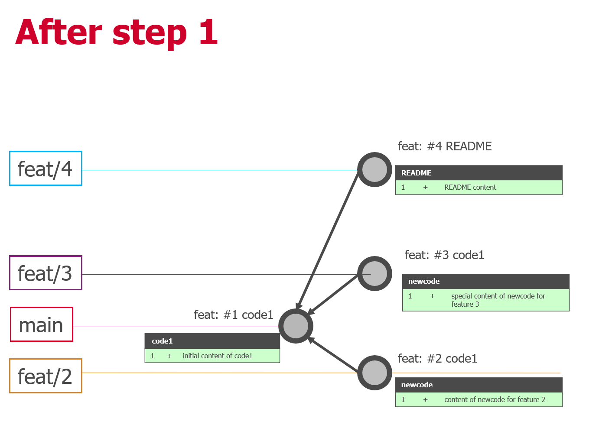
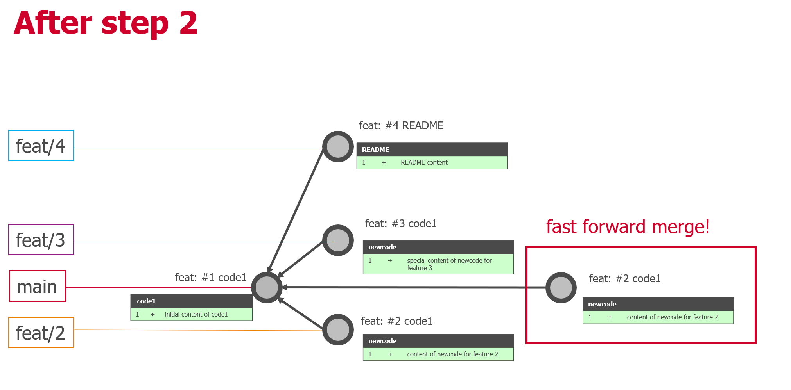
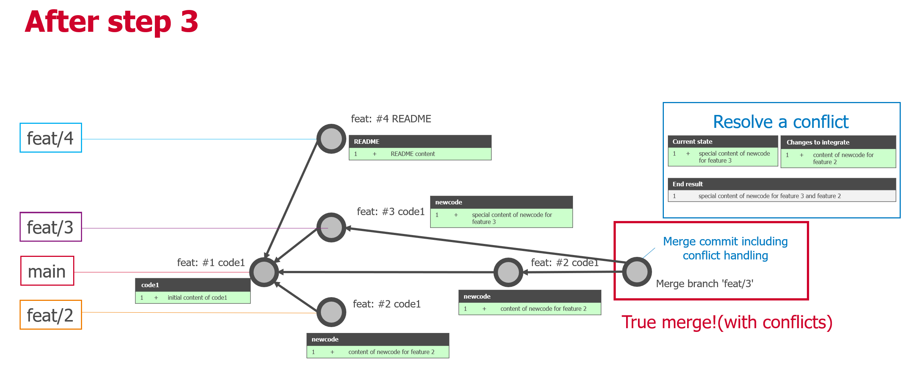
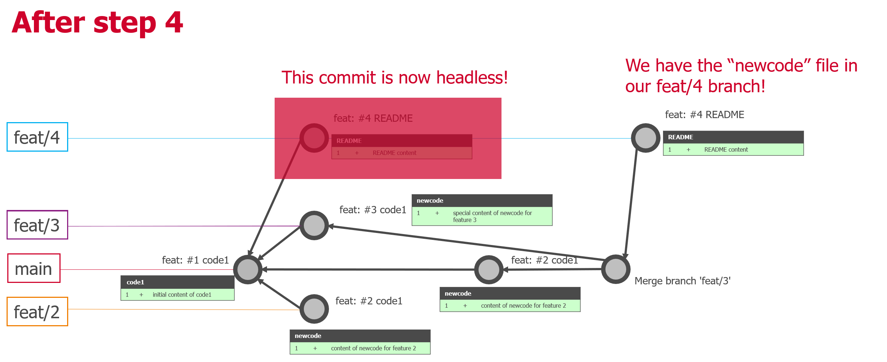

# GIT WORKSHOP

[See also the git training page.](./git_training.md)

[See also the git cheat sheet.](./git.md)

## Config

To do :

- Create a new folder
- Initialize a local repo
- Use git config to edit the global .gitconfig
- It should open in an external editor (notepad++ for instance). If in VIM, close the file with :q! then play the following command where you replace the correct path to notepad++: `git config --global core.editor "'C:/Program Files/Notepad++/notepad++.exe' -multiInst -notabbar -nosession -noPlugin"`
- Use git config to edit the local .git/config
- List current config
- Add a new alias
- See the content of this new alias
- Use this new alias
- Setup your username and user email

<details>
<summary>Reveal commands</summary>
<p>

```bash
git init
git config --edit
git config --edit --global
git config --list
git config --global alias.ceg "config --edit --global"
git config alias.ceg
git ceg
git config --global user.name "Your Name"
git config --global user.email you@soprasteria.com
```

</p>
</details>

## Alias collection

For those interested, you can copy paste the content of [this .gitconfig](https://github.com/jcaillon/Notes/blob/master/git/.gitconfig) file in your global .gitconfig file.

This is a collection of aliases that are very handy in day-to-day actions with GIT.

## Commit

To do :

- In the local repo created earlier...
- Create a new file named `file` (random content or empty file)
- Create a new file named `file2`
- Show the repo status
- Add both files to the index
- Show the repo status
- Commit both
- Show the repo status
- Show the commit history
- Rename `file2` to `file3`
- Show the repo status
- Commit `file3`
- Show the repo status
- Create a new file named `file4`
- Modify the content of `file3`
- Show the repo status
- Add all modifications to the index
- Show the repo status
- Commit
- Show the repo status
- Create a tag named v1
- Show the commit history

<details>
<summary>Reveal commands</summary>
<p>

```bash
touch file
touch file2
git status
git add -- file file2 # or git add --all
git status
git commit
git status
git log
git mv file2 file3
git status
git commit
git status
touch file4
echo "coucou" > file3
git status
git add --all
git status
git commit
git status
git tag v1
git log
```

</p>
</details>

## Reset, checkout with file path

To do:

- From a new local repo...
- Create a new file `file` (put some random content)
- Create a new file `file2` (empty file)
- Add both files to the index
- Show the repo status
- remove `file` from the index (do not delete from your working directory!)
- Commit only `file2`
- Show the repo status
- Show the commit history
- Rename `file2` to `file3`
- Commit `file` and `file3`
- Remove `file` from the index and the working directory
- Show the repo status
- Commit to only keep `file3`
- Restore `file` in the working directory and the index as it was in the 2nd commit (make sure it restored its content)
- Add all to the index
- Commit
- Modify `file3`
- Show the repo status
- Add `file3` changes to the index
- Show the repo status
- Restore the index for `file3` (keep modifications in your working directory)
- Show the repo status
- Discard all modifications to `file3`
- Show the repo status
- Amend your last commit to modify the message

<details>
<summary>Reveal commands</summary>
<p>

```bash
git init
echo "coucou" > file
touch file2
git add -- file file2
git status
git reset -- file # in this case equivalent to git rm --cached -- file
git commit
git status
git log
git mv file2 file3
git add file
git commit
git rm file
git status
git commit
git checkout HEAD~ -- file
git commit
echo "modification" > file3
git status
git add file3
git status
git reset -- file3
git status
git checkout -- file3
git status
git commit --amend
```

</p>
</details>

## Branch, reset, checkout without file path

To do :

- From your local repo (use the same as the previous page)...
- List all (local) branches and notice the current branch name (master or main)
- create a tag v2 on the current commit
- Override the content of file3 with a random string
- Commit this modification
- Reset the main branch to the previous commit without restoring the index and working directory
- Commit again the modifications on file3 (notice that it is another way to amend the previous commit)
- Create a new branch feat/1 from the tag v2 created earlier (using git branch)
- Notice the current branch in git bash
- Show the log of commits
- Create a new branch feat/2 from the tag v2 using git checkout
- Show the log of commits, notice the current branch
- Override the content of file3 with a random string
- Attempt to checkout the master/main branch
- Discard changes to file3
- Checkout the master/main branch
- Show the log of commits
- Reset the master/main branch to the tag v2 (reset index + working directory)
- Show the log of commits
- delete branch feat/1

<details>
<summary>Reveal commands</summary>
<p>

```bash
git branch
git tag v2
echo "my string" > file3
git add --all && git commit
git reset --soft HEAD^
git commit
git branch feat/1 v2
git log
git checkout -b feat/2 v2
git log
echo "my NEW STRING" > file3
git checkout main
git checkout -- file3
git checkout main
git log
git reset --hard v2
git log
git branch -d feat/1
```

</p>
</details>

## Merge, rebase

### Step 1

- Create a new folder and init a new git repository
- create a new file code1 with content "initial content of code1"
- commit the file with message "feat: #1 code1"
- Create a new branch feat/2 from master with git checkout
- create a new file newcode with content "content of newcode for feature 2"
- Commit with the message "feat: #2 newcode"
- Create a new branch feat/3 from master with git checkout
- create a new file newcode with content "special content of newcode for feature 3"
- Commit with the message "feat: #3 newcode"
- Create a new branch feat/4 from master with git checkout
- create a new file README with content "readme content"
- Commit with the message "feat: #4 README"

<details>
<summary>Reveal commands</summary>
<p>

```bash
echo "initial content of code1" > code1
git add --all && git commit -m "feat: #1 code1"
git checkout -b feat/2
echo "content of newcode for feature 2" > newcode
git add --all && git commit -m "feat: #2 newcode"
git checkout -b feat/3 master
echo "special content of newcode for feature 3" > newcode
git add --all && git commit -m "feat: #3 newcode"
git checkout -b feat/4 master
echo "README content" > README
git add --all && git commit -m "feat: #4 README"
```

</p>
</details>

Take a look at the following picture to understand the situation:



### Step 2

Let's proceed...

- Checkout master branch
- Merge feat/2 into master

<details>
<summary>Reveal commands</summary>
<p>

```bash
git checkout master
git merge feat/2
```

</p>
</details>

Take a look at the following picture to understand the situation:



### Step 3

Continue on the same repo.

We now also want to integrate the changes from feat/3 in master

- merge the branch feat/3 to master (it will say there are conflicts)
- show git status
- visualize the content of newcode
- Abort the current merge
- Again, merge branch feat/3 to master
- fix conflict (with tortoise git), the merged result must be "special content of newcode for feature 3 and feature 2"
- Add the fixed file to the staging area
- Finish the merge, name the merge commit "Merge branch 'feat/3'

<details>
<summary>Reveal commands</summary>
<p>

```bash
git merge feat/3
git status
git diff
git merge --abort
git merge feat/3
echo "special content of newcode for feature 3 and feature 2" > newcode
git add newcode
git merge --continue
```

</p>
</details>

Take a look at the following picture to understand the situation:



### Step 4

Now we want to get back to work on our feature 4; but we want to integrate the recent changes done on master.

- checkout the feat/4 branch
- verify that you do not have the newcode file
- show git log
- rebase feat/4 on master
- verify that you have the newcode file
- show git log

<details>
<summary>Reveal commands</summary>
<p>

```bash
git checkout feat/4
ls
git log
git rebase master
ls
git log
```

</p>
</details>

Take a look at the following picture to understand the situation:



## Rebase interactive

<details>
<summary>Script to create the local repo.</summary>
<p>

Create a .sh file, copy the following commands in it then execute it with `sh file.sh`.

```bash
git init
touch A
git add --all
git commit -m "added A"
touch B
touch C
git add --all
git commit -m "added B and C"
touch F
git add --all
git commit -m "added F"
touch E
git add --all
git commit -m "derp E"
touch D1
git add --all
git commit -m "added D part 1"
touch D2
git add --all
git commit -m "added D part 2"
```

</p>
</details>

To do :

- Show the log of this repo
- Commits should be in alphabetical order (oldest A, newest F)
- Correct the message `derp E` to be `added E`
- Split the commit `added B and C` into 2 commits adding 1 file each
- Squash the 2 commits `added D part 1` and `added D part 2` into a single commit `added D` with the 2 files D1 and D2

<details>
<summary>Reveal solution</summary>
<p>

```bash
git rebase -i HEAD~5
```

Rebase file :

```text
e 36047e2 added B and C
pick e206ef8 added D part 1
s b05c717 added D part 2
r 4259336 derp E
pick 783b96b added F
```

The rebase stops after applying B and C :

```bash
git log
git rm --cached C
git commit --amend -m "added B"
git add C
git commit -m "added C"
git rebase --continue
```

The rebase stops asking the commit message from squashing D1 and D2 together. Input `added D`.

Finally it stops asking the new message for `derp E`. Input `added E`.

</p>
</details>