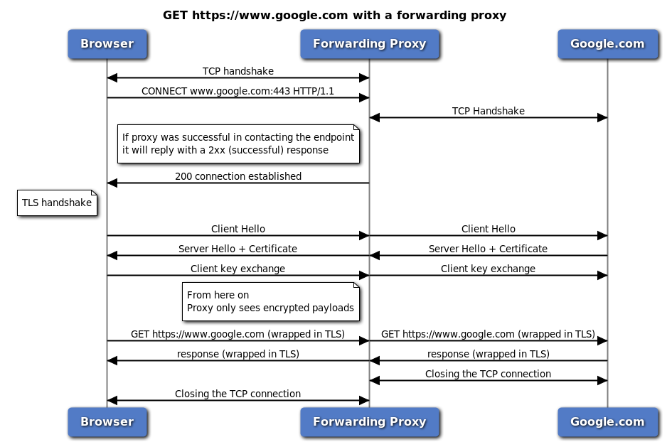
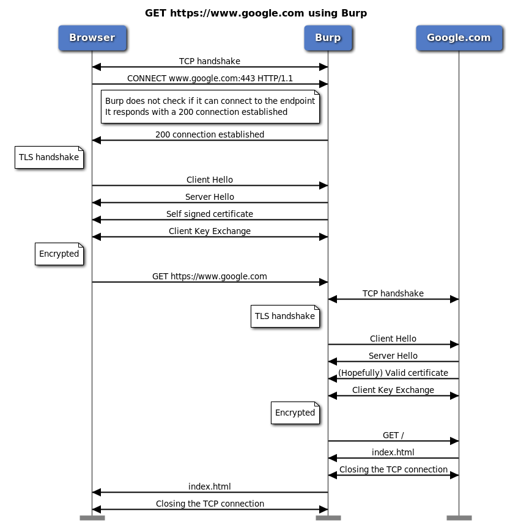

https://parsiya.net/blog/2016-07-28-thick-client-proxying---part-6-how-https-proxies-work/
https://en.wikipedia.org/wiki/Proxy_server

https://jegansblog.wordpress.com/2015/05/07/setup-fiddler-as-proxy-server-with-basic-authentication/

`prefs set fiddler.proxy.creds bXlVc2VyOm15UGFzc2NvZGU=`

http://www.fiddler2.com/fiddler/help/hookup.asp#Q-LocalTraffic

> Internet Explorer and the .NET Framework are hardcoded not to send requests for Localhost through any proxies, and as a proxy, Fiddler will not receive such traffic.
>
> The simplest workaround is to use your machine name as the hostname instead of Localhost or 127.0.0.1. So, for instance, rather than hitting http://localhost:8081/mytestpage.aspx, instead visit http://machinename:8081/mytestpage.aspx.

https://developer.mozilla.org/en-US/docs/Web/HTTP/Authentication

https://blogs.msdn.microsoft.com/wsdevsol/2012/10/25/how-to-accommodate-authenticating-proxies-in-net/