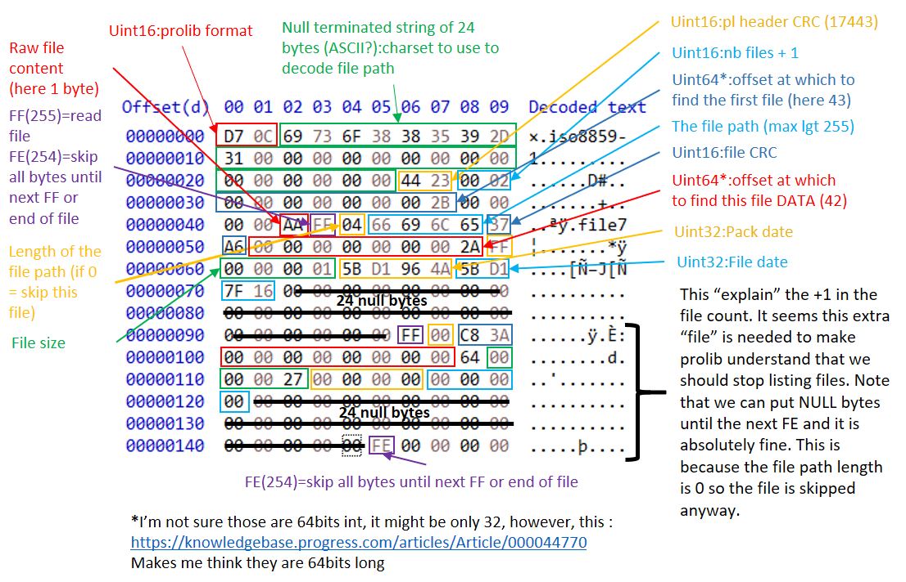
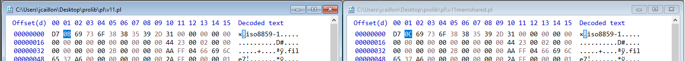

# PROLIB

The byte order to use to read numbers from a pro-library is **Big endian**.

## The structure of a prolib

## How to read the file list

Read the header:

- Read the prolib format (2 bytes)
- Read the code page (null terminated string; max 24)
- Read the header CRC (2 bytes)
- Read the number of **file entry** expected (2 bytes)
- Read the offset at which to find the directory listing (8 bytes)
- *At that point you can check the header CRC if you want*

Read the directory listing (i.e. list of file entries):

1. Go to the *directory listing offset*
2. Read the first byte which will be either FF (255) or FE (254):
    1. FF: you should read the following file entry
    2. FE: you should skip all the following bytes until...
        1. You reach the end of the stream (in that case, stop reading)
        2. You read an FF byte (in which case, you continue)
3. Read the file path length (1 byte)

## The different prolib format

### v11

- Standard : `55051`
- Mem shared : `55052`

### v7

- Standard : `55047`

### Difference between v11 and v7

## What happens when you successively add/delete files

The prolib utility does not actually entirely rewrite the .pl file, it just append the new file (in case of a add) and then rewrite the whole directory (the list of files) at the end.

The header of the library is then updated (first 42 bytes):

- Number of files = old number of files + the one added
- The offset at which to find the directory listing (which has changed since the list is now at the end)
- The CRC of the header which needs to be re-computed because of the value changed above

**This explain the purpose of the `-compress` which actually properly rewrites the file**.

## Difference between a standard and shared library

Only 1 byte is changed.

The format of file, which is a Uint16 stored in the first 2 bytes, goes from `55051` to `55052` (at least for v11 libraries).

The actual difference is in how the openedge session handle this file (it seems!).
