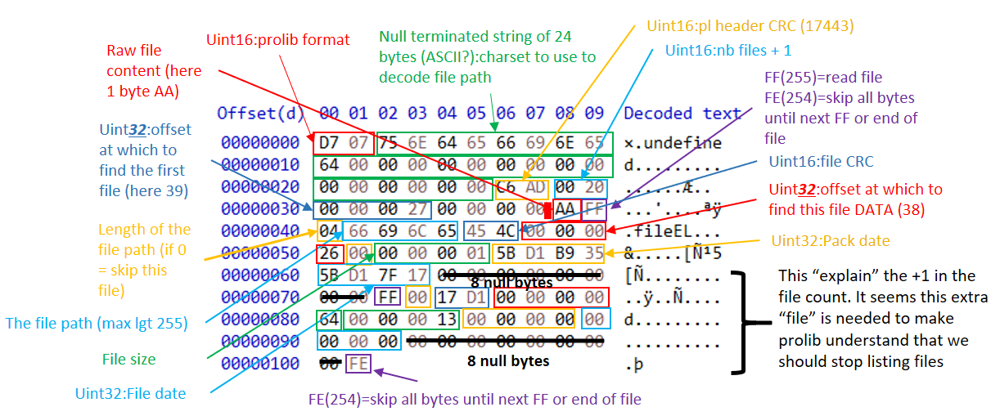

# PROLIB

> This page sums up my knowledge of openedge pro-libraries (.pl files).

This page exists so that you can make your own implementation of a pro-library archiver. If you are a C# user, you can take a look at my implementation [in Oetools.Utilities](https://github.com/jcaillon/Oetools.Utilities).

You will also find handy samples of pro libraries that helped me gather those info [here](prolib.zip).

Miscellaneous info on prolib :

- The byte order to use to read numbers from a pro-library is **Big endian**.
- The file data inside a prolib is uncompressed.

## The structure of a prolib

The v11 structure:


## How to read the file list

Read the header:

- Read the prolib format (2 bytes : 215[0xD7] + version between 7 and 12)
- Read the code page (null terminated string; max 24)
- Read the header CRC (2 bytes)
- Read the number of **file entry** expected (2 bytes)
- Read the offset at which to find the directory listing (8 bytes)
- *At that point you can check the header CRC if you want*

Read the directory listing (i.e. list of file entries):

1. Go to the *directory listing offset*
2. Read the first byte which will be either FF (255) or FE (254) or 0:
    1. 255[0xFF]: you should read the following file entry
    2. 254[0xFE] or 0: you should skip all the following bytes until...
        1. You reach the end of the stream (in that case, stop reading)
        2. You read an 255[0xFF] byte (in which case, you continue to step 3)
3. Read the file path length (1 byte):
    1. If the length is 0, read the file entry as stated below but note that this is not a "real" file
    2. If >0, read the file entry:
        1. Read the file path (the length is fixed and known, the encoding to use was in the header)
        2. Read the file CRC (2 bytes)
        3. Read the file offset in this .pl file (8 bytes)
        4. Read 1 byte (255[0xFF]=not a rcode=type O, 10[0x0A]=an rcode=type R,100[0x64]=the last 'non' file)
        5. Read the file size (4 bytes)
        6. Read the packing date (4 bytes)
        7. Read the file date (4 bytes)
        8. Skip 24 null bytes (I don't understand the purpose of those bytes, they seem unused)
        9. *At this point, you can check the constancy of the crc value*
        10. Back to step 2

The last file has a file path of length 0, a size of 39[0x27] and a type of 100[0x64]. Its CRC value is 51258[0xC8 3A].

## Crc computation

The prolib format uses CRC-16/ARC.

### Header Crc


### File entry Crc


### How to compute the Crc

You can find a c# implementation below. Note that the crc table should only be computed once, we recompute it here just to simplify the code snippet.

```csharp
public static ushort ComputeCrc(int value, byte[] data) {
    var crcTable = new ushort[256];
    for (int j = 0; j < crcTable.Length; j++) {
        for (short k = 1, l = 0xC0; k < byte.MaxValue ; k <<= 1, l <<= 1) {
            if ((j & k) != 0) {
                crcTable[j] ^= (ushort) (0xC001 ^ l);
            }
        }
    }
    foreach (var b in data) {
        var crcTableIdx = (value ^ b) & byte.MaxValue;
        value = value / 256 ^ crcTable[crcTableIdx];
    }
    return (ushort) value;
}
```

## How to write a prolib

You can reverse the instructions of the reading part:

- Write the header
- Write the data
- Write the file entries

**One very important thing to note about file entries:** file entries are actually written in 'blocks' of 512 bytes. When writing file entries, keep track of current block size written (the sum of file entry length):

- if the next file entry to read will make the current block exceeds or equal 512 bytes, write FE (254) and then null bytes to fill the current block (512), then reset the block size counter
- otherwise, write the file entry as usual, starting with FF (255)

## The different prolib versions

### Differences between v11 and v7

The main difference is that the v7 was using 32bits integers and the newer version uses 64bits integers.

The v7 structure:



The differences are:

- The use of 64 bits integer for :
  - The offset at which to find the first file entry
  - The offset at which to find each file data
- Only 8 null bytes after a file entry, instead of 24
- The last file has a file path of length 0, a size of 19[13] and a type of 100[64]. Its CRC value is 6097[17 D1].

### Openedge v10+

- Standard : `11`
- Mem shared : `12`

### Before Openedge v10

- Standard : `7`
- Mem shared : `8`

## What happens when you successively add/delete files

The prolib utility does not actually entirely rewrite the .pl file, it just append the new file (in case of a add) and then rewrite the whole directory (the list of files) at the end.

The header of the library is then updated (first 42 bytes):

- Number of files = old number of files + the one added
- The offset at which to find the directory listing (which has changed since the list is now at the end)
- The CRC of the header which needs to be re-computed because of the value changed above

**This explain the purpose of the `-compress` which actually properly rewrites the file**.

## Difference between a standard and shared library

Only 1 byte is changed, which is the library version.


The actual difference is in how the openedge session handle this file (it seems!).
